## Hummer框架简析与@hummer/tenon-vue解析

### 背景

​		[Hummer](https://hummer.didi.cn/) 是滴滴开发团队推出的，一套性能高且可用的跨端开发框架，一套代码可以同时支持开发 Android 和 iOS 应用。现已经支持 Vue、React、TypeScript、JavaScript 等四种语法，面向大前端开发人员。由于框架的设计与架构特点，非常适合拥有原生开发经验、web前端开发经验以及跨栈经验的开发者掌握，基于以上，hatom开发者团队借鉴器其开源项目，将其中Vue、TypeScript语法接入到hitom平台下的hatom框架中。

### 架构特点

​		框架的结构特点：web前端上层基于Vue与TypeScript语法开发出的前端业务应用， 原生端基于quickjs引擎拓展的底层Hummer框架的API，最后将web端前端应用包嵌入到原生端带有Hummer API的引擎中进行页面渲染和语法解析。原生端是基于quickjs引擎提供底层服务，此处有原生开发者进行探索；web前端则是需要基于Vue框架或是TypeScript语法进行学习掌握，主要是基于vue拓展的@hummer/tenon-vue开发框架与TypeScript语法开发方式。以下将简要比对TypeScript语法与vue语法的优劣，对TypeScript语法进行简述，对@hummer/tenon-vue进行详解。

### 原生Android掌握的TypeScript语法

#### 简述

​		TypeScript语法（简称ts）面向的是Android纯原生开发者编程方式，经过本人在测温访客机终端应用开发项目的实践，发现其不太适合前端Vue技术开发人员。首先，入门者需要掌握ts基础语法，同时适应原生安卓开发面向原生控件编程经验。下面分享一段ts的代码， 主要是一个登录页面。

#### 示例

```typescript
// 引入原生控件的声明
import { Hummer, View, Text, Input, Button, Toast, Navigator, Dialog } from '@hummer/hummer-front'
// 自定义控件
import { Header } from '@/components/header';
class LoginView extends View {
  private userNameInput: Input;
  private passworInput: Input;
  private tapCount: number;
  private dailog: Dialog = new Dialog();
  private serviceDailog: Dialog = new Dialog();
  constructor() {
    super();
    this.style = {
      width: '100%',
      height: '100%',
      alignItems: 'center',
      backgroundColor: '#464F63'
    }
    this.tapCount = 0;
    this.initTitleBar()
    this.initContentView()
  }
 // 头部样式布局
  private initTitleBar() {
    let header = new Header("云帆测温访客终端");
    header.style = {
      width: '100%',
      height: 80,
      flexDirection: 'row',
      alignItems: 'center',
    }
    header.rightImg.src = Img.EXIT;
    // 添加点击事件  
    header.rightImg.addEventListener('tap', (evnet) => {
      HatomPlugin.closeApp(() => { }, {})
    })
    this.appendChild(header);
  }
  // content样式布局
  private initContentView() {
    let contentLayout = new View();
    contentLayout.style = {
      width: 450,
      height: 350,
      marginTop: 30,
      borderRadius: 10,
      alignItems: 'center',
      backgroundColor: Color.grey,
    }
    this.appendChild(contentLayout)

    let tipText = new Text();
    tipText.text = "欢迎登录-云帆测温访客终端"
    tipText.style = {
      fontSize: 25,
      height: 60,
      marginTop: 20,
      textAlign: 'center',
      color: Color.white,
      fontWeight: 'bold'
    }
     
    tipText.addEventListener("tap",()=>{
      this.tapCount++;
      console.log(this.tapCount)
      if (this.tapCount > 5) {
        this.initServiceDailog()
        setTimeout(() => this.tapCount = 0, 1000)
      }
    })
    contentLayout.appendChild(tipText)

    //用户名**********************************
    let userNameLayout = new HatomInput();
    userNameLayout.leftImg.src = Img.inputName;
    this.userNameInput = userNameLayout.input;
    this.userNameInput.placeholder = "请输入用户名";
    userNameLayout.style = {
      height: 50,
      width: '85%',
      marginTop: 20,
    }
    this.userNameInput.style = {
      ...this.userNameInput.style,
      backgroundColor: Color.transparent,
      fontSize: 20,
      cursorColor: Color.white
    }
    this.userNameInput.text = "";
    contentLayout.appendChild(userNameLayout)

    //用密码**********************************
    let passwordLayout = new HatomInput();
    passwordLayout.leftImg.src = Img.inputPassword;
    this.passworInput = passwordLayout.input;
    this.passworInput.placeholder = "请输入密码"
    passwordLayout.style = {
      height: 50,
      width: '85%',
      marginTop: 15
    }
    this.passworInput.style = {
      ...this.passworInput.style,
      backgroundColor: Color.transparent,
      fontSize: 20,
      cursorColor: Color.white,
      marginLeft: 10,
      type: 'password'
    }
    this.passworInput.text = "";
    contentLayout.appendChild(passwordLayout)

    //登录**********************************
    let loginButton = new Button()
    loginButton.text = "登 录"
    loginButton.addEventListener('tap', (event) => {
      // 登录按钮事件响应
    });
    loginButton.style = {
      backgroundColor: Color.red,
      color: Color.white,
      fontSize: 30,
      width: '85%',
      height: 50,
      marginTop: 50,
      fontWeight: 'bold',
      borderRadius: 10,
    }
    contentLayout.appendChild(loginButton)
  }
}
// 根页面渲染
Hummer.render(new LoginView());
```

​		以上可以看出其面向对象编程，定义一个class 类—— 继承原生控件view的LoginView类,。 创建一个LoginView类的对象，传入到Hummer的render方法中。每个标签换成了view、button、image等基础原生控件，将所有的css样式属性作为一个map对象，赋值到控件的style属性上。通过控件的addEventListener接口API做事件的监听。其开发方式与前端开发者常见的vue/react都不太相同。代码的编写调试相比以往的前端代码，更加的冗余，写法也更加复杂。所以得出结论为不太适合一般的web前端开发者。

### 前端web推荐的Hummer Vue语法

#### 简述

​		应用于 `Hummer` 引擎的 Vue 框架，使用的是 Vue3.0 的语法，快速的构建用户界面。@hummer/tenon-vue是Tenon Vue 的核心控件，整体内核，是通过 Vue3.0 的 createRenderer 方法，自定义渲染器，同时针对 Hummer 引擎进行差异化改造。在此强调的是其中不同点，@hummer/tenon-vue的模板语法中标签采用的是特有的标签。设计背景是为了更多的适配hummer引擎，因为环境不同于web浏览器，很多 Web 标签特性原生很难兼容到hummer引擎，所以就类似小程序一样，自定义一套标签([UI组件库](https://github.com/OrangeLab/hummer-front))。每个标签在hummer中对应的是Android中的原生控件，其使用细节在此不做赘述，教程可以[参考](https://hummer.didi.cn/doc-tenon/vue_quick_start.html)。

#### 解析

​		首先可以了解一下vue框架的工程化结构，一般的工程化是vue+webpack的结合。vue部分负责的主要是应用业务代码，通过编译器插件vue-loader关联到webpack的配置中，通过webpack的配置打包机制，将vue框架语法编译成可执行的js文件和可渲染的render函数，整个工程化的结构如下图：

<div style="text-align: center">
    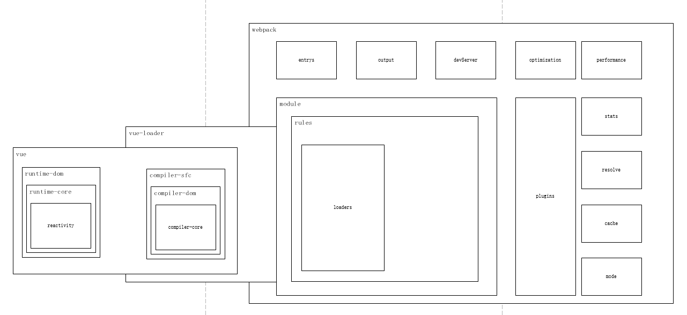
</div>
<div style="text-align: center">
 图1 工程化vue + webpack图
</div> 

​		我们的vue业务代码核心库是reactivity与compiler-core，基于两个核心库拓展了runtime-core->runtime-dom  与 compiler-dom->compiler-sfc 等两个方面。前者一般指的是runtime运行时用来构建，更新，渲染dom的功能，主要是操作dom节点，类似于前端1.0时代的jquery插件库，后者一般指的是模板编译器，主要是模板字符串的解析，主要操作解析的是一些指令等基础语法与一些AST的结构转换。

<div style="text-align: center">
    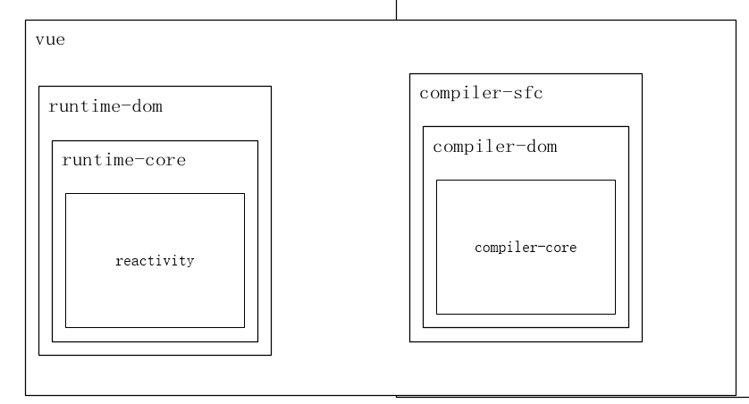
</div>
<div style="text-align: center">
 图2 工程化vue的源码结构
</div> 

#### cli结构设计

​		hummer框架的结构设计同样是基于vue + webpack结构，整个结构的核心库是@hummer/tenon-vue。围绕核心库的插件的使用，hummer框架推出了@hummer/cli脚手架，使用@hummer/cli脚手架来作为唯一的调度中心。其中不但集成了所有webpack的工程化相关的插件，也集成了七个工程模板的下载，其中包含的vue工程模板，就是我们的开发的起点。如下图：

<div style="text-align: center">
    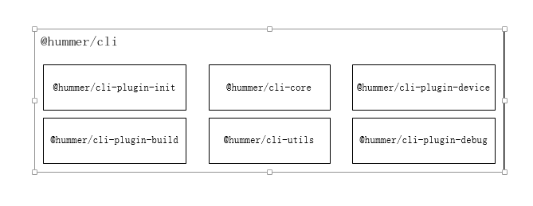
</div>
<div style="text-align: center">
 图3 脚手架@hummer/cli结构图
</div> 

脚手架的插件如下：

- @hummer/cli-plugin-init：初始化的是 hummer init 命令行的逻辑，下载模板的逻辑
- @hummer/cli-core：初始化其他命令行设置，分发脚手架的命令逻辑
- @hummer/cli-plugin-device：初始化设备真机调试中，依赖native启动Android或是iOS设备
- @hummer/cli-plugin-build：命令行hummer dev 与 hummer build命令行的逻辑
- @hummer/cli-utils：提供CLI 的基础工具库，供插件内核和各个插件使用
- @hummer/cli-plugin-debug：Hummer 的调试插件，ws的热更新逻辑


<div style="text-align: center">
    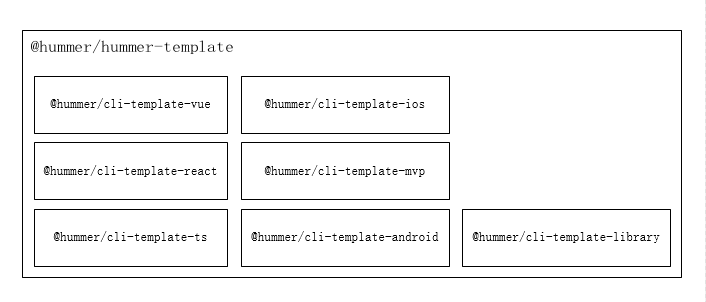
</div>
<div style="text-align: center">
 图4 脚手架模板结构图
</div> 

​		其中的模板主要是@hummer/cli-template-vue， 下文中会继续描述，模板中包含了其他插件@hummer/tennon-loader与@hummer/tenon-store，提供了vue框架开发的工程模板。

#### 模板工程中cli命令

工程模板中cli中的启动/打包命令分别对应```hummer dev``` 和 ```hummer build`` 两个命令，其中cli命令逻辑整体架构如下：

<div style="text-align: center">
    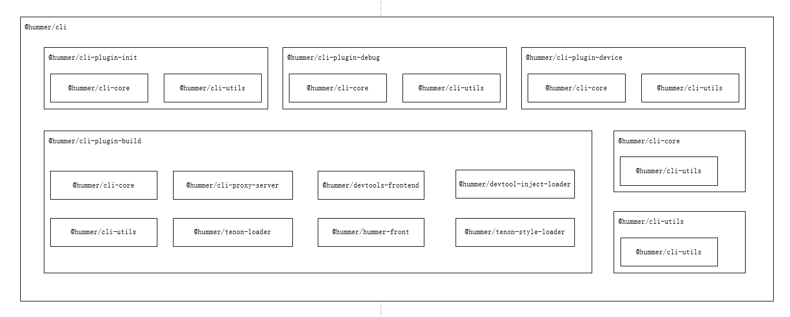
</div>
<div style="text-align: center">
 图5 脚手架插件依赖结果图
</div> 

模板的启动/打包命令在@hummer/cli-plugin-build，其中的依赖@hummer/cli-core，@hummer/cli-utils是公共依赖，其他依赖说明如下：

- @hummer/cli-proxy-server：提供 debugger client 和 debugger native 之前的代理服务
- @hummer/tenon-loader：@hummer/tenon-vue 专用 Loader, 增加了样式处理相关逻辑，主要是样式逻辑需要特殊处理，以及底层 css 的样式解析
- @hummer/tenon-style-loader： 专用的 Webpack 样式解析 Loader，用于处理进行样式转换
- @hummer/devtools-frontend：hummer cli 前端项目，主要是项目启动后加载前端页面
- @hummer/devtool-inject-loader：用于Hummer-CLI 在dev模式下向hummer ts项目入口文件注入运行时调试工具代码
- @hummer/hummer-front：Hummer Front 是针对 Hummer Web 的库，用于 Web 测试环境中，便于调试使用

#### 模板@hummer/cli-template-vue

@hummer/cli-template-vue模板中的依赖如下：

<div style="text-align: center">
    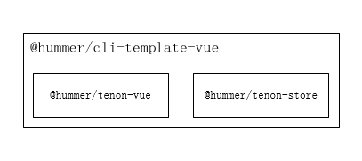
</div>
<div style="text-align: center">
 图6 脚手架vue模板的依赖结果图
</div> 

- @hummer/tenon-vue：Hummer Vue 的核心运行时，用于 Tenon Vue 项目中使用。
- @hummer/tenon-store：Hummer Vue 的 vuex 解决方案，增加上 Tenon Vue 的适配，增加多页面数据共享的逻辑处理。

### 解析@hummer/tenon-vue

#### 简介		

Tenon Vue 是 Hummer Vue 的核心运行时，用于 Tenon Vue 项目中使用。属于hummer框架下Vue语法的核心库，其中库中集成了vue框架中全部的语法API，同时拦截项目中的标签语法以及dom指令，将view层的标签操作，转换为底层UI控件操作。兼容Vue的语法中的dom的特殊操作到底层面向UI控件的转换。同时自定义了调试工具插件，建立了ws,http链接，将刷新逻辑发送到调试工具的原生端页面以及web端的页面为热更新。其中的依赖如下：

```json
"@hummer/tenon-dev-tool": "0.2.6",
"@hummer/tenon-utils": "1.2.15",
"@vue/reactivity": "3.3.9",
"@vue/runtime-core": "3.3.9"
```

#### 结构设计

​		通过@hummer/tenon-vue核心插件的源码仓库， 对比vue框架下@vue/runtime-dom插件源码目录结构， 截图如下，左侧是vue框架源码的目录结构，右侧是hummer框架下的tenon-vue源码的目录结构：

<div style="display:flex;justify-content: space-around; align-items:center">
    <div class="left">
        <div style="text-align: center">
            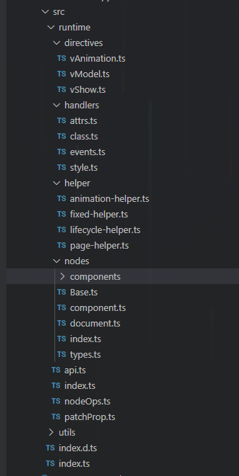
        </div>
        <div style="text-align: center; margin-top:8px">
         图6 @hummer/tenon-vue 目录结构
        </div> 
    </div>
    <div class="right">
        <div style="text-align: center">
            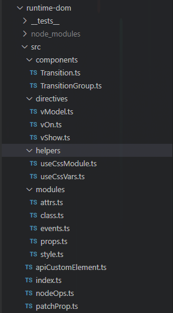
        </div>
        <div style="text-align: center; margin-top:15px">
         图7 @vue/runtime-dom 目录结构
        </div> 
    </div>

接着对比package.json的依赖文件库，@hummer/tenon-vue的依赖如下:
```json
"dependencies": {
    "@hummer/tenon-dev-tool": "^0.2.6",
    "@hummer/tenon-utils": "^1.2.15",
    "@vue/reactivity": "3.2.11",
    "@vue/runtime-core": "3.2.11"
  },
```

vue框架下的@vue/runtime-dom插件中package.json中的依赖如下：

```json
"dependencies": {
    "@vue/runtime-core": "3.2.11",
    "@vue/shared": "3.2.11",
    "csstype": "^2.6.8"
 }
```

基于以上我们做出大概的结论，@hummer/tenon-vue的插件是@vue/runtime-dom的插件库的拓展，通过入口文件index.ts中看到如下：

```javascript
import {render} from './runtime'
export * from './runtime'
export * from './utils/style'
export default {
  render
}
```

文件夹runtime/index.ts的文件中看到：

<div style="text-align: center">
    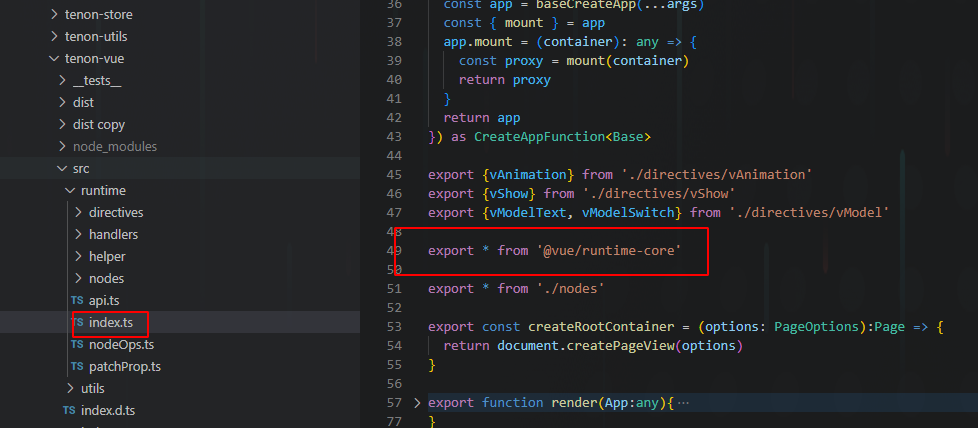
</div>
<div style="text-align: center">
 图8 @hummer/tenon-vue中runtime/index.ts的文件
</div> 

#### 结论

- 根据入口文件，看到hummer/tenon-vue中继承了@vue/runtime-core的所有API；

- 通过目录结构得出结论同时重构了一些指令directives与components内置组件；

- 兼容attrs、class、events与style的特殊操作；

- 补充了vue2.x的一些钩子函数以及组件加载过程中声明周期；

  

### 使用@hummer/tenon-vue

#### 模板工程

@hummer/tenon-vue框架插件的使用在@hummer/cli-template-vue模板工程中，我们找一段模板工程中的基础代码，工程目录如下：

<div style="text-align: center">
    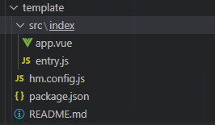
</div>
<div style="text-align: center; margin-top: 8px">
 图9 @hummer/cli-template-vue 模板工程目录
</div> 

目录中的hm.config.js配置文件为@hummer/cli脚手架中```hummer dev```  与 ``` hummer build ```命令脚本的配置信息，包括了webpack配置以及type模板类型说明，配置文件如下：
```javascript
const path = require('path')
module.exports = {
  type: 'tenon',
  webpack: {
    entries: "src/*/entry.js",
    output: {
      path: path.resolve(__dirname, './dist'),
      filename: "[name].js"
    }
  }
}
```

找到package.json中依赖文件说明：

```json
"dependencies": {
    "@hummer/tenon-vue": "^1.7.0",
    "@hummer/tenon-store": "^1.0.0"
 },
```

找到入口文件entry.js文件，从入口文件开始分析到如下：

```javascript
import * as Tenon from '@hummer/tenon-vue';
import app from './app';
Tenon.render(app);
```

模板工程中应用代码的初始化是@hummer/tenon-vue中的render函数，这里是插件库的主函数，接下来我们根据render主函数，进入到源码中进一步分析。

#### render函数的源码结构

打开@hummer/tenon-vue源码工程，从入口文件src/runtime/index.ts中，追踪函数的逻辑，得到如下图：

<div style="text-align: center;">
    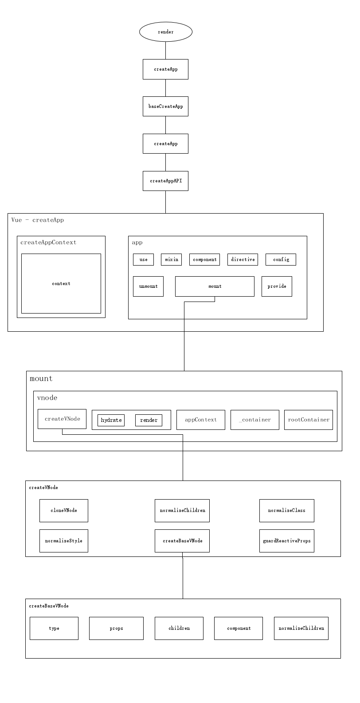
</div>
<div style="text-align: center; margin-top: 8px">
 图10 render函数的源码结构
</div> 

​		从以上的总结轮中得知，@hummer/tenon-vue不但导出了所有@vue/runtime-core中继承的所有API，还做了其他的兼容attrs、class、events与style的特殊操作，重构了一些指令directives与components内置组件，补充了vue2.x的一些钩子函数以及组件加载过程中声明周期。我们挑出主线中的render函数为主干线，找出其自定义的逻辑。自定义的逻辑分为：构建统一的上下文createAppContext，兼容全局的API；重构了createApp流程，做了组件周期的hook API。 将自定义的hook指令属性以及兼容特殊处理，传入到createRenderer的闭包参数中。

#### 解析createRenderer

在创建App应用中，主要是createRenderer函数， 其中代码逻辑如下：

<div style="text-align: center;">
    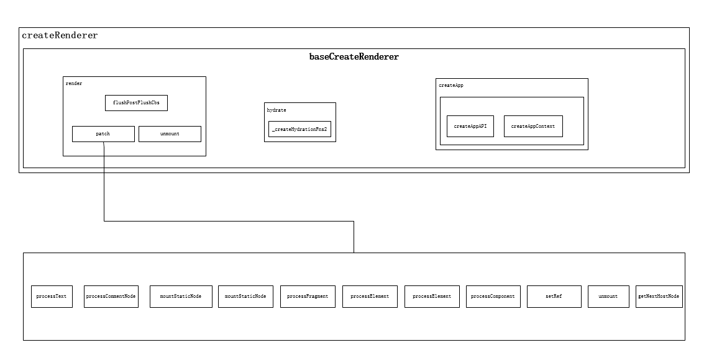
</div>
<div style="text-align: center; margin-top: 8px">
 图11 createRenderer函数的源码结构
</div> 

其中最重要的是换节点在，文件src/runtime/index.ts中：

<div style="text-align: center;">
    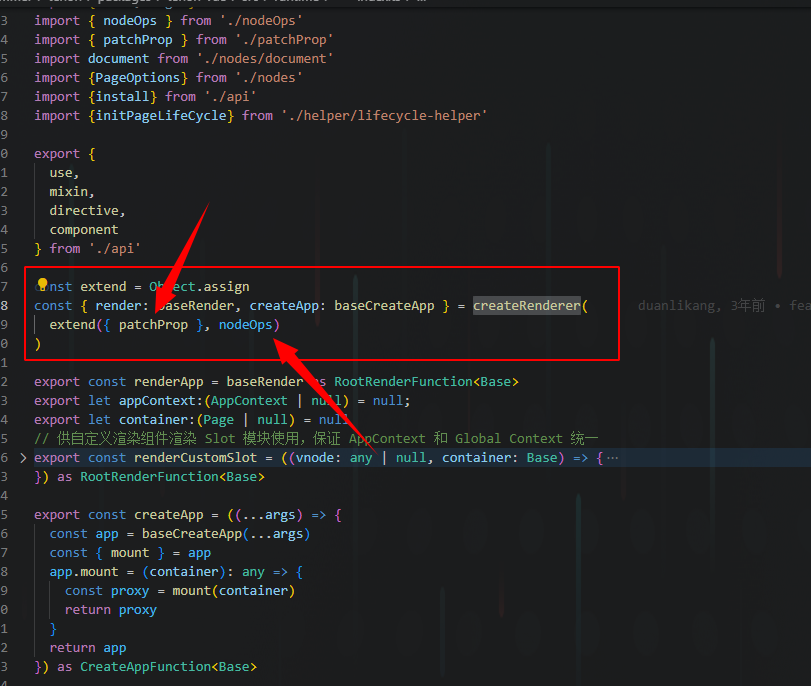
</div>
<div style="text-align: center; margin-top: 8px">
 图11 createRenderer的源码
</div> 

​		将自定义的nodeOps 与 patchProp 的对象传入到createRenderer函数，该函数的参数是RendererOptions对象，包含的属性主要是RendererNode与RendererElement两个类，其中追踪到了@vue/runtime-core插件中baseCreateRenderer的代码逻辑，主要的参数是RendererOptions对象，包含的属性主要是RendererNode与RendererElement两个类。

- RendererNode：处理的是vnode节点的逻辑；
- RendererElement：处理的是dom节点的增删改查等逻辑；

#### 解析baseCreateRenderer

​		baseCreateRenderer参数为RendererNode与RendererElement，前者是处理vnode节点中的class、style、event等属性，主要通过自定义的是patchProp函数，兼容hummer框架下的patchClass、patchStyle、patchAttrs、patchEvents特殊操作。替换其中的el的标签为Hummer框架下的Base基类控件 ；后者是同时替换elememt为base，后者是node节点对应的dom的增、删、改、查等操作，处理的是函数有：
```javascript
export const nodeOps = {
  insert,
  remove,
  createElement,
  createText,
  createComment,
  setText,
  setElementText,
  parentNode,
  nextSibling,
  querySelector,
  setScopeId
}
```

参数传入到函数中，主要通过patch函数分发各个vnode的nodeOps中钩子函数。其中的替换掉的不仅是基础操作，还有基类Element被替换为Base。

#### 解析基类Base

​		基类的**Base** 与 **Element** 的对比，在一般的web开发中，**Element**指的是HTML元素，是构成网页的基本构建块。**`Element`** 是最通用的基类，[`Document`](https://developer.mozilla.org/zh-CN/docs/Web/API/Document) 中的所有元素对象（即表示元素的对象）都继承自它。它只具有各种元素共有的方法和属性。更具体的类则继承自 `Element`。在hummer框架开发中，参照web端的Elememt，自定义了hummer引擎的基类Base。基于基类的Base，Hummer框架中推出了在[Hummer UI](https://github.com/OrangeLab/hummer-front) 组件库。


### 总结开发注意事项

#### UI组件库

UI组件库[hummer-front](https://github.com/OrangeLab/hummer-front), 使用[教程](https://hummer.didi.cn/doc-tenon#/zh-CN/component_view)

- **View** 基本视图
- **Text** 文本
- **Image **图片
- **Button **按钮
- **Input** 输入框
- **TextArea** 文本输入框
- **Scroller **滚动容器
- **HorizontalScroller **横向滚动容器
- **List** 复用列表
- **ViewPager** 轮播
- **Navigator** 路由模块
- **Animation** 动画模块
- **Toast** Toast 提示
- **DialogDialog**  弹窗

#### 图片加载

无效加载方式

直接加载相对路径是无效的 如下：

```html
 <image src="../assets/images/logo.png"></image>
```

有效加载方式

1、使用 require()函数进行图片加载

```html
 <image :src="require('../assets/images/logo.png')"></image>
```

2、使用require()函数之后的地址

首先在代码中执行require()函数

```javascript
created() {
  require('../assets/images/logo.png')
}
```

之后会在dist文件下images下有图片路径， 直接填写dist下的文件路径， 如下

```html
 <image src="../images/logo.png)"></image>
```

#### 动态class

这种是无效的写法，无法动态加载样式，如下：

```html
 <view :class="active? 'acive-class':''"></view>
```

使用 :style="{ width: currentImage === v ? 50: 56, height: currentImage === v ? 50: 56 }"

#### 背景图片

css中无效的写法， 如下：

background-color: url("../assets/images/logo.png")

#### style样式

不建议使用 scss/sass/less

```css
<style>

.active-class {
  // css 属性
}
</style>
```

#### 网路请求

axios/ajax 无效

采用hummer封装的网络请求对象 request

```javascript
var request = new Request();
request.url = "http://xxx.xxx.xxx.xxx:8000/test";
request.method = "GET";
request.send((response) => {
    /**
     * status	 number	状态码	{ status: 200 }
	* header	 Object	请求头信息	
	* data	     Object	响应数据	{ data: { aa: 11, bb: 22} }
	* error	     Object	请求错误	{ error: { code: 404, msg: 'not found' } }
    */
});
```

#### API调用

Hummer 原生的API，使用[教程文档](https://hummer.didi.cn/doc#/zh-CN/hummer)

##### Hummer.env

内置环境变量。

| 属性名          | 类型   | 说明                                             | 示例       |
| :-------------- | :----- | :----------------------------------------------- | :--------- |
| platform        | string | 平台类型                                         | `'iOS'     |
| osVersion       | string | 平台系统版本号                                   | `'14.0'    |
| appVersion      | string | App版本号                                        | `'1.0'`    |
| appName         | string | App名字                                          | `'Hummer'` |
| statusBarHeight | number | 状态栏高度（单位：dp或pt）                       | `44`       |
| safeAreaBottom  | number | iOS安全区域高度（单位：dp或pt）（Android可忽略） | `34`       |
| deviceWidth     | number | 设备宽度（单位：dp或pt）                         | `414`      |
| deviceHeight    | number | 设备高度（单位：dp或pt）                         | `896`      |
| availableWidth  | number | 可用范围宽度（单位：dp或pt）                     | `414`      |
| availableHeight | number | 可用范围高度（单位：dp或pt）                     | `852`      |
| scale           | number | 像素缩放比例                                     | `3`        |

##### Hummer.notifyCenter

全局消息通知类。

```js
/**
 * 设置消息监听事件
 * 
 * @param event 事件名称
 * @param callback 接收消息回调，value为消息内容
 */
 addEventListener(event: String, callback: (value: Object) => void)
/**
 * 取消消息监听事件
 * 
 * @param event 事件名称
 * @param callback 接收消息回调，addEventListener时的callback对象
 */
 removeEventListener(event: String, callback: (value: Object) => void)
/**
 * 发送消息
 * 
 * @param event 事件名称
 * @param value 消息内容
 */
 triggerEvent(event: String, value: Object)

```

##### demo示例代码

```javascript
// 渲染Hummer页面
Hummer.render(new View());
// 获取平台类型
let platform = Hummer.env.platform;

// 全局消息中心
let callback = (value) => {};
// 设置消息监听
Hummer.notifyCenter.addEventListener("event", callback);
// 取消消息监听
Hummer.notifyCenter.removeEventListener("event", callback);
// 发送消息
Hummer.notifyCenter.triggerEvent("event", {test: 1234});
```

##### 进阶API

[数据传递](https://hummer.didi.cn/doc#/zh-CN/android_doc_advanced#liu-shu-ju-chuan-di)、[页面跳转](https://hummer.didi.cn/doc#/zh-CN/android_doc_advanced#wu-ye-mian-tiao-zhuan)、自定义API[Bridge 用法](https://hummer.didi.cn/doc#/zh-CN/android_doc_advanced#si-bridge-yong-fa) 、[教程](https://hummer.didi.cn/doc#/zh-CN/android_doc_advanced)，调用自定义API方法

Test 原生java静态类

```js
Test.nativeFunc(111, 222);
```

自定义导出类 TestModel,  onTest 为 java实例方法

```
const test = new TestModel();
test.onTest()
```

