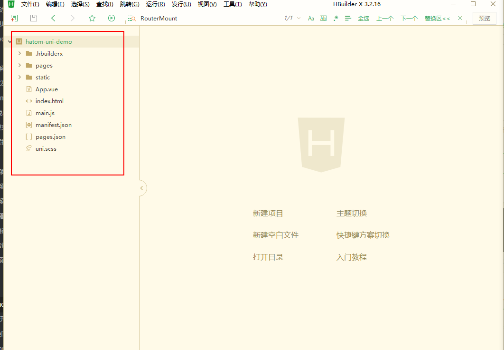

### 1、hatom云编译服务支持uni-app引擎打包

​		随着移动app开发技术的成熟，目前市场上支持跨端开发的框架层出不穷，当前国内最受欢迎的是DClound推出的uni-app框架。为了方便hatom框架的开发者的使用，hatom云编译服务引入了uni-app引擎，支持uni-app项目工程成果物zip, 打包apk。

适用场景：

- 拥有uni-app开发经验者，不需要深入学习hatom框架开发规范，直接使用HBuilderX工具对接hatom定制插件，上传到我们的云编译服务线上打包

- 已经开发成型的uni-app应用，进行二次深入开发，对接海康内部业务组件，可以引入我们的uni_modules插件，直接使用我们的业务组件/定制插件

- 熟悉hatom2-cli脚手架开发者，可以使用交互式命令，选择hatom-uni-tpl工程模板，导入其他编辑器（webstorm、vscode、sublime）开发使用

使用方式：

- 基于HBuilderX工具,创建的原有的项目中，引入hatom插件

- 基于hatom2-cli脚手架，直接拉取项目模板，进行二次开发

### 2、hatom-uni-app使用方式一：

2.1、下载HBuilderX工具 [地址](https://www.dcloud.io/hbuilderx.html)，打开工具

<div></div>

2.2、新建项目选择uni-app，输入项目名称，点击创建

<div> </div>

2.3、创建项目如下：

<div></div>


2.4、HBuilder插件[市场](https://ext.dcloud.net.cn/)，搜索安装hatom插件，如下

<div></div>


2.5、引入hatom插件

<div></div>
2.6、打开HBuilderX工具

<div></div>

2.7、选择引入的项目

<div></div>


2.8、插件目录如下

<div></div>

2.9、在项目main.js中，引入插件代码

```javascript
import Hatom from "@/uni_modules/pxy-hatom/js_sdk/hatom.js"

Vue.protoType.$hatom = new Hatom();
```

```javascript
// 基础插件调用
this.$hatom.scan(res => {
    console.log(res)
})

// 其他业务插件的调用
this.$hatom.native("Plugin.funcName", (res)=>{
    // 返回参数
}, options)
```

> 了解更过插件，查看[文档](https://hatom2.hikyun.com/doc/h5-developer/H5-api.html)

### 3、hatom-uni-app使用方式二：

使用hatom2-cli脚手架（v2.3.0+），[了解更多](https://hatom2.hikyun.com/doc/h5-developer/H5-developer.html) 下载[模板工程](http://iris.hikvision.com.cn/pengxueyou/hatom-uni-tpl)，

3.1、开始

全局模式：

``` bash
hatom init uni-tpl hello
```

非全局模式：

```bash
npx hatom init uni-tpl hello
```

3.2、选配

``` bash
# ? 项目名称（hello）
<enter>
# ? 项目描述（A hatom project）
hello project
# ? 版本（1.0.0）
<enter>
# 作者 (support.hikyun@hikvision.com.cn)

<enter>
# ？安装vuex（Y/n）
<enter>
# ? 路由组件（Use arrow.keys）
 > uni官方推荐的路由，不安装其他插件
  一个完全相似Vue-router的路由插件
<enter>
# ? 是否使用ESLint规范代码行为（Y/n）
<enter>
# ?  request请求（Use arrow keys）
 > uni官方开放的request，不安装其他插件
  使用axios封装request
<enter>
```

3.3、运行

下载安装HBuilderX工具[下载](https://www.dcloud.io/hbuilderx.html)，打开导入到HBuilderX工具，右键->本地导入->选择脚手架生成的模板工程

<div></div>

导入模板工程如下：

<div></div>


3.4、目录

<div></div>


3.5、demo工程

下载命令：

``` bash
hatom init uni-demo hello
```


### 4、调试方法

调试方法在HBuilder中使用自定义基座调试方式，自定义基座方式一：hatom平台线上，创建应用，打包调试应用APK，方式二：下载平台上提供的自定义基座APK。调试步骤如下：

4.1、新建uin-app项目，在HBuilderX编辑器内，先制作自定义基座

<div></div>

4.2、配置自定义基座参数

<div></div>

4.3、将项目代码编译出目录，目录下会有一个unpakcage目录，找到

<div></div>

删掉原来的android_debug.apk，将平台自定义的APK替换到这个目录下。

4.4、运行调试APK方式，先选择运行->运行到手机/模拟器->自定义基座选择->自定义基座

<div></div>

<br />4.5、在选择运行->运行到手机/模拟器->运行到设备

<div></div>

