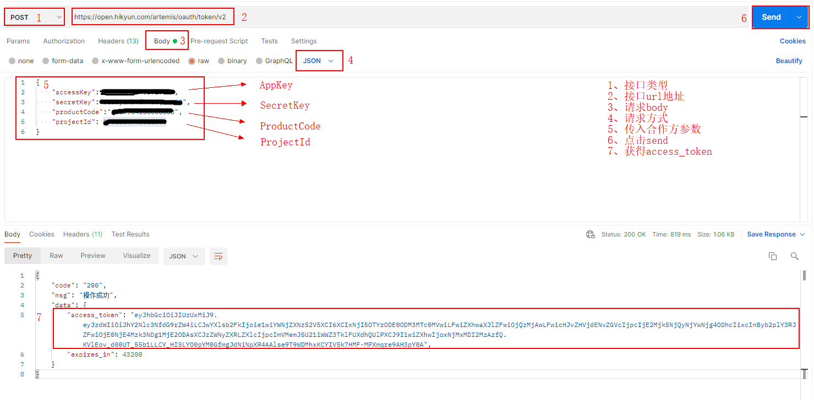
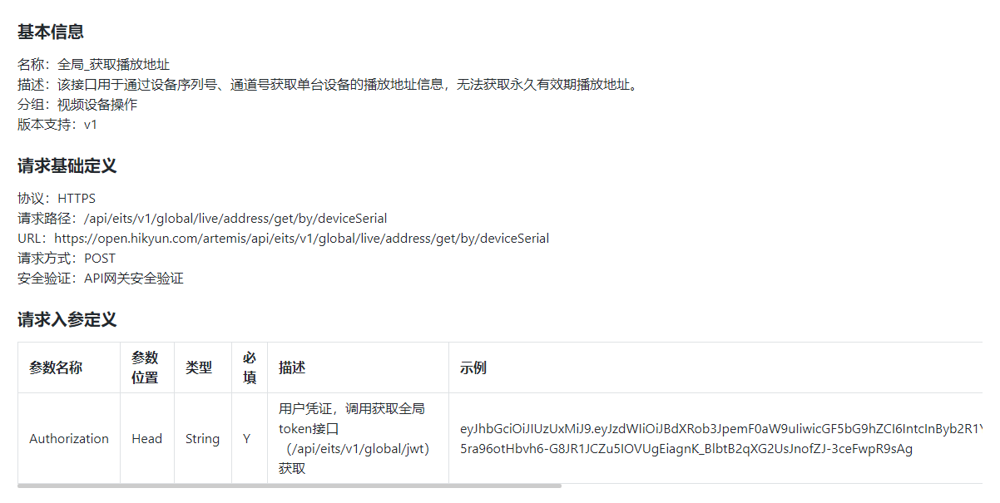
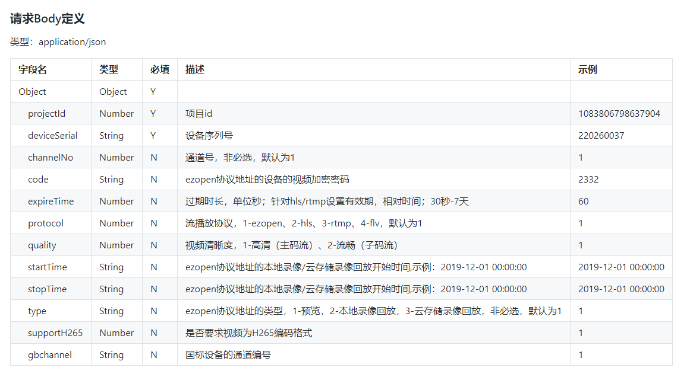
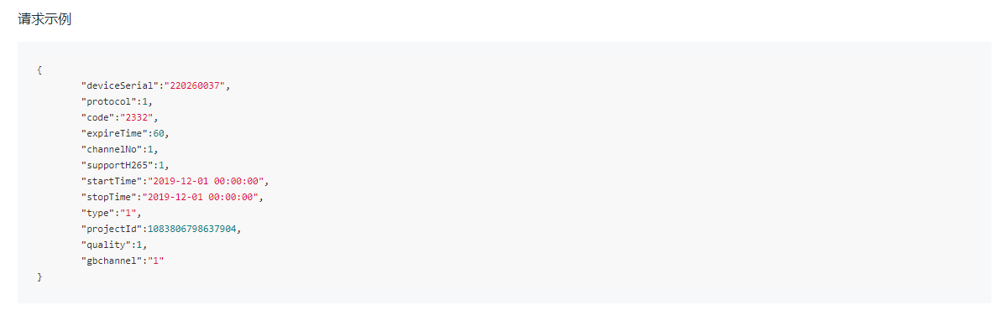
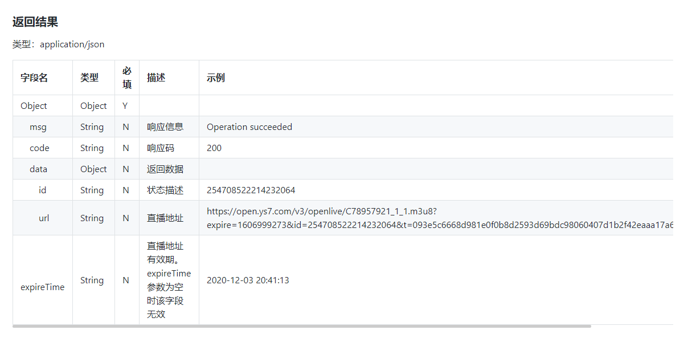
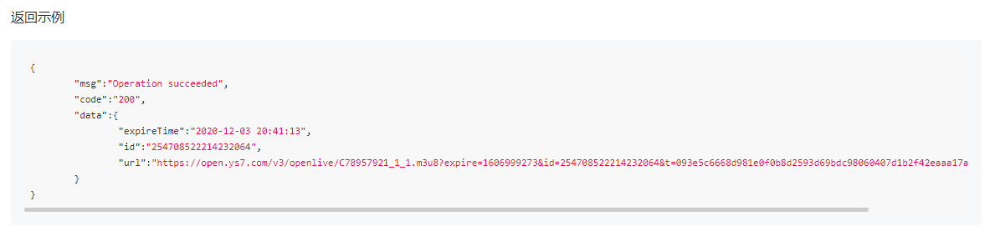

### 云曜视频服务接入

### 1、开通云曜平台账号，查阅帮助文档

#### 1.1、登录云曜控制台账号，获取AppKey以及SecretKey

[API对接指南](https://help.hikyun.com/document/1630580675701243/1631083015084848/0#1__AppKeySecretKey_0)

    

#### 1.2、通过产品标识（produceCode）与项目编号（projectId）参数

#### 1.3、获取调用令牌

通过1、2获取的参数accessKey（AppKey）、secretKey（SecretKey）、productCode(产品标识)、projectId(项目编号)调用接口，[获取调用令牌](https://help.hikyun.com/document/1630580675701243/1631083015084848/0)**access_token**，所有接口的调用都需要access_token。调用接口时，将access_token放入Headers参数中。

调用接口：https://open.hikyun.com/artemis/oauth/token/v2
请求方式：POST
参数格式：JSON

#### 1.4、通过接口获取码流播放地址

查阅[API对接文档](https://help.hikyun.com/document/1630585400375028/371/1#%E5%85%A8%E5%B1%80_%E8%8E%B7%E5%8F%96%E6%92%AD%E6%94%BE%E5%9C%B0%E5%9D%80)调用接口，获取码流播放地址如下：

