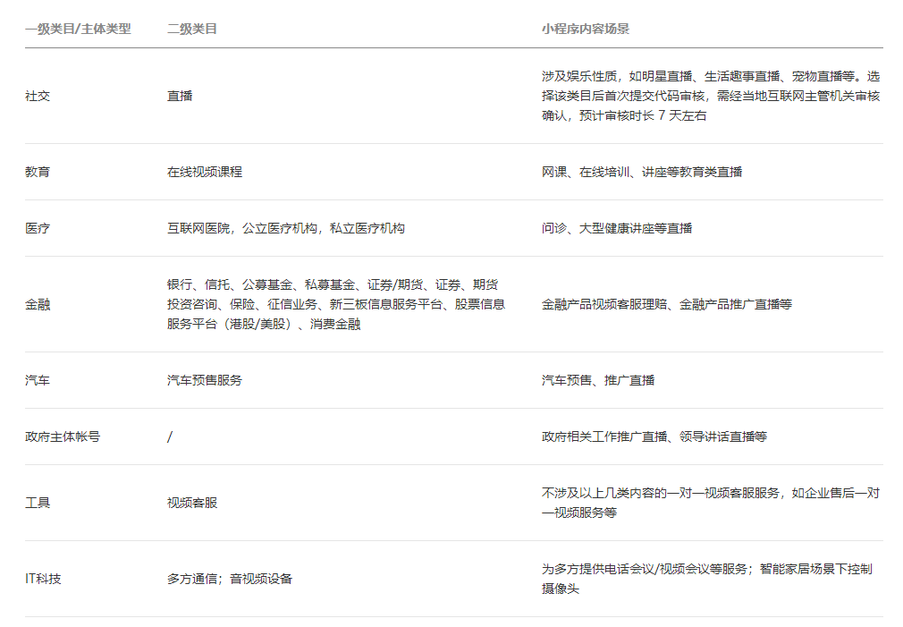
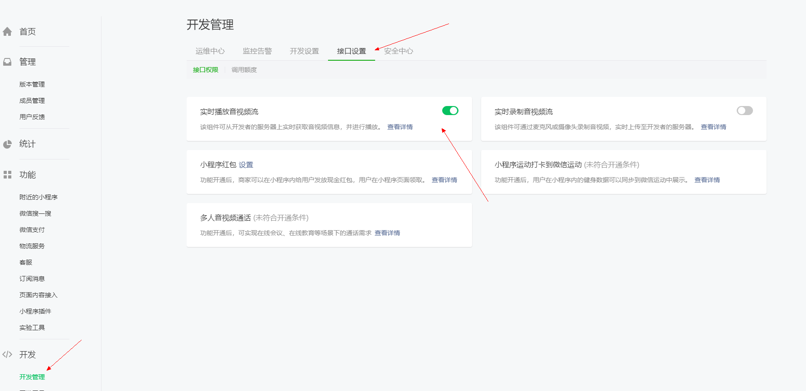
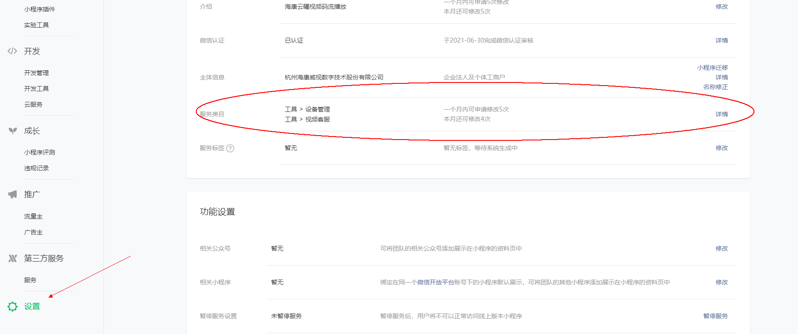

### 使用live-player组件播放视频

#### 1、申请小程序账号

[微信公众平台](https://mp.weixin.qq.com)申请小程序账号，阅读小程序开发文档，使用live-player组件视频播放时，**需注意填写小程序服务类目**，查阅官方文档可知，只有特殊服务类目的小程序账号才可以开通视频直播，具体可查阅[文档链接](https://developers.weixin.qq.com/miniprogram/dev/component/live-player.html)

<div></div


#### 2、开通组件播放能力

根据规定，目前国内主体如下类目的小程序开放，需要先通过类目审核，再在小程序管理后台，「开发」-「接口设置」中自助开通该组件权限

<div></div

针对不是特殊类目的小程序，需要添加修改小程序账号的服务类目

<div></div


点击详情进入，点击添加类目之后，需要账号管理员权限扫码才可以修改


#### 3、接入云曜视频服务能力

接入云曜视频能力，调取[云曜开发接口](https://help.hikyun.com/document/1630585400375028/371/1#%E5%85%A8%E5%B1%80_%E8%8E%B7%E5%8F%96%E6%92%AD%E6%94%BE%E5%9C%B0%E5%9D%80)，在接口中协议参数**protocol** 值为3/4获取视频码流地址，将下面任一协议的播放地址放入live-player的src中即可

RTMP协议：`rtmp://rtmp.open.ys7.com/openlive/设备ID[.清晰度]`

FLV协议：`https://rtmp01open.ys7.com/openlive/设备ID[.清晰度]`

#### 4、使用live-player组件

在小程序中使用[live-player](https://developers.weixin.qq.com/miniprogram/dev/component/live-player.html)播放组件，实时音视频播放（v2.9.1 起支持[同层渲染](https://developers.weixin.qq.com/miniprogram/dev/component/native-component.html#原生组件同层渲染)）。相关API：[wx.createLivePlayerContext](https://developers.weixin.qq.com/miniprogram/dev/api/media/live/wx.createLivePlayerContext.html)

```html
<live-player id="player" src="{{ videoSrc }}" mode="RTC" autoplay bindstatechange="handleLivePlayerStateChange" binderror="handleLivePlayerError"></live-player>
<!-- 播放停止状态 -->
<cover-view class="video-loaing video-ready" hidden="{{videoLoadingStatus !== 0}}">
	<cover-image class="loading-gif" src="../live/images/live/landscape_play.png" catchtap="handlePlay">
    </cover-image>
</cover-view>
```

> 基础库 1.7.0 开始支持，低版本需做[兼容处理](https://developers.weixin.qq.com/miniprogram/dev/framework/compatibility.html)。

```javascript
// 页面ready
onReady(res) {
    // 初始化
    this.ctx = wx.createLivePlayerContext('player')
},
// 播放
handlePlay() {
    this.ctx.play({
      success: res => {
        console.log('play success')
      },
      fail: res => {
        console.log('play fail====', res)
      }
    })
 },
```

