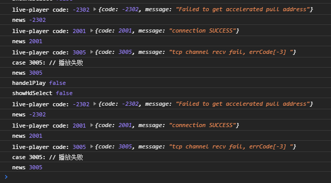

### 1、视频回放

根据摄像头设备接入协议的提供方式、可将设备类型分为：行业设备和与萤石设备。行业设备一般使用的是IOT物联接入协议，萤石设备接入的是萤石设备协议。咨询产品经理后知，云曜主要接入的是萤石设备，萤石的接入方式[API文档](https://open.ys7.com/doc/zh/book/index/account-api.html)。云曜的设备接入是基于萤石的接入协议，在此基础上进行接口二次封装，提供设备接入能力以及其他开放能力，方便用户设备接入以及开放能力对接。

接入云曜后，可根据云曜提供的项目ID(projectId)/产品编码(productCode)、云曜接口令牌accessToken,获取设备能力。视频回放，云曜主要开放接口主要有两个。

- 一、根据设备序列号和通道号查询录像片段[文档地址](https://help.hikyun.com/document/1630983006059551/325/1#3__a_id_a_135)

- 二、根据时间段参数查询设备码流播放地址[文档地址](https://help.hikyun.com/document/1630983006059551/1636976779455260/0)

### 2、视频码流编码格式

萤石设备码流的编码格式支持两种编码格式H264与H265。查阅文档可知，H264的编码格式是传统的也是沿用时间最长，同时也是大多数解码器支持的编码格式，H265是在H264的基础上的升级版，相较为H264，H265的压缩率更高，传输效率更高。但在一般设备视频解码播放上的支持，会有兼容性问题。

咨询萤石设备技术支持，萤石设备出厂默认支持H265编码格式。怎么切换设备编码格式，需要在萤石官网[下载](https://service.ys7.com/downloadInfoSite/admin)萤石工作室

</div

