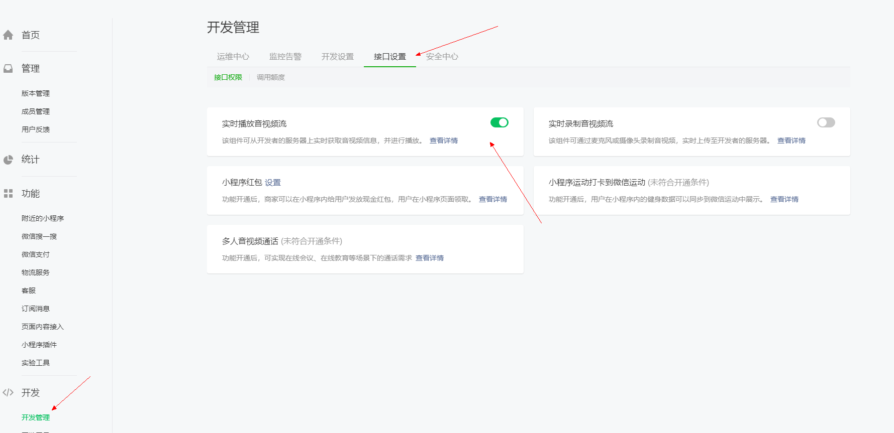
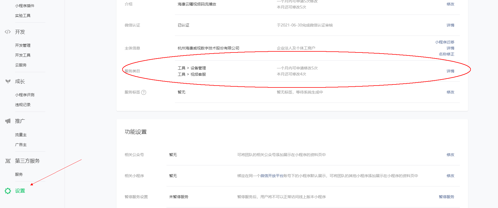

小程序：hikyun@aliyun.com/Hikyun~!@345   海康云曜测试AI小程序

hikyunplayer@163.com/Abc12345  海运云曜码流播放小程序

### 1、申请小程序账号

[微信公众平台](https://mp.weixin.qq.com)申请小程序账号，阅读小程序开发文档，填写小程序服务类目时注意了，只有特殊服务类目的小程序账号才可以开通直播

<div></div


根据规定，目前国内主体如下类目的小程序开放，需要先通过类目审核，再在小程序管理后台，「开发」-「接口设置」中自助开通该组件权限

<div></div

针对不是特殊类目的小程序，需要添加修改小程序账号的服务类目

<div></div


点击详情进入，点击添加类目之后，需要账号管理员权限扫码才可以修改


### 2、开通云曜平台账号，查阅帮助文档

#### 2.1、登录云曜控制台账号，获取AppKey以及SecretKey

[API对接指南](https://help.hikyun.com/document/1630580675701243/1631083015084848/0#1__AppKeySecretKey_0)

<div>
    
</div>


#### 2.2、通过产品标识（produceCode）与项目编号（projectId）参数

<div></div>


#### 2.3、获取调用令牌

通过1、2获取的参数accessKey（AppKey）、secretKey（SecretKey）、productCode(产品标识)、projectId(项目编号)调用接口，[获取调用令牌](https://help.hikyun.com/document/1630580675701243/1631083015084848/0)**access_token**，所有接口的调用都需要access_token。调用接口时，将access_token放入Headers参数中。

调用接口：https://open.hikyun.com/artemis/oauth/token/v2
请求方式：POST
参数格式：JSON

<div></div>


#### 2.4、通过接口获取码流播放地址

查阅[API对接文档](https://help.hikyun.com/document/1630585400375028/371/1#%E5%85%A8%E5%B1%80_%E8%8E%B7%E5%8F%96%E6%92%AD%E6%94%BE%E5%9C%B0%E5%9D%80)调用接口，获取码流播放地址如下：

<div></div>

<div></div>

<div></div>

<div></div>

<div></div>


### 3、调用live-player插件播放视频

> 只支持flv与rtmp格式码流

```html
<live-player id="player" src="{{ videoSrc }}" mode="RTC" autoplay bindstatechange="handleLivePlayerStateChange" binderror="handleLivePlayerError"></live-player>
```

```javascript
// 页面ready
onReady(res) {
    // 初始化
    this.ctx = wx.createLivePlayerContext('player')
},
// 播放
handlePlay() {
    this.ctx.play({
      success: res => {
        console.log('play success')
      },
      fail: res => {
        console.log('play fail====', res)
      }
    })
  },
```

### 4、调用video插件播放hls格式的码流

```html
      <video 
        id="myVideo" 
        src="{{videoSrc}}" 
        binderror="videoErrorCallback" 
        show-casting-button
        show-screen-lock-button
        show-center-play-btn='{{false}}' 
        show-play-btn="{{true}}" 
        picture-in-picture-mode="{{['push', 'pop']}}"
        bindenterpictureinpicture='bindVideoEnterPictureInPicture'
        bindleavepictureinpicture='bindVideoLeavePictureInPicture'
        enable-auto-rotation="{{enableAutoRotation}}"
      ></video>
```


Mozilla/5.0 (Linux;Android6.0.1;ZC-83A Build/MMB29M) AppleWebKit/537.36 (KHTML, like Gecko) Chrome/68.0.3440.70 Safari/537.36
