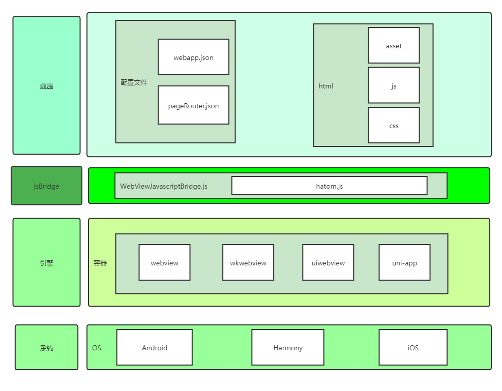
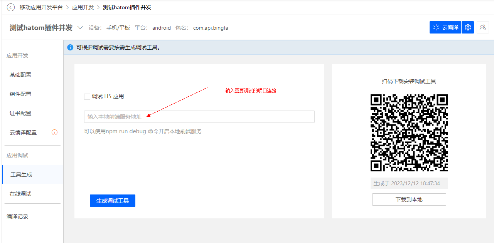
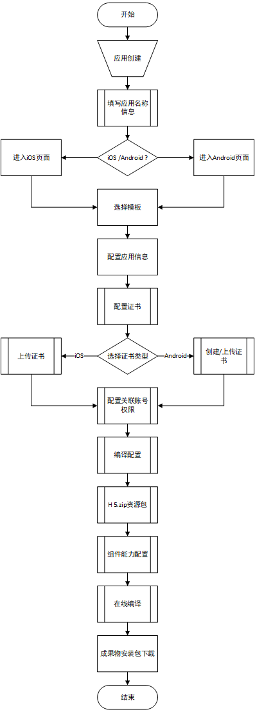
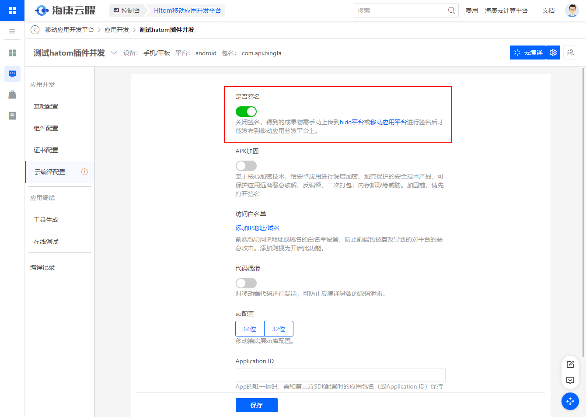
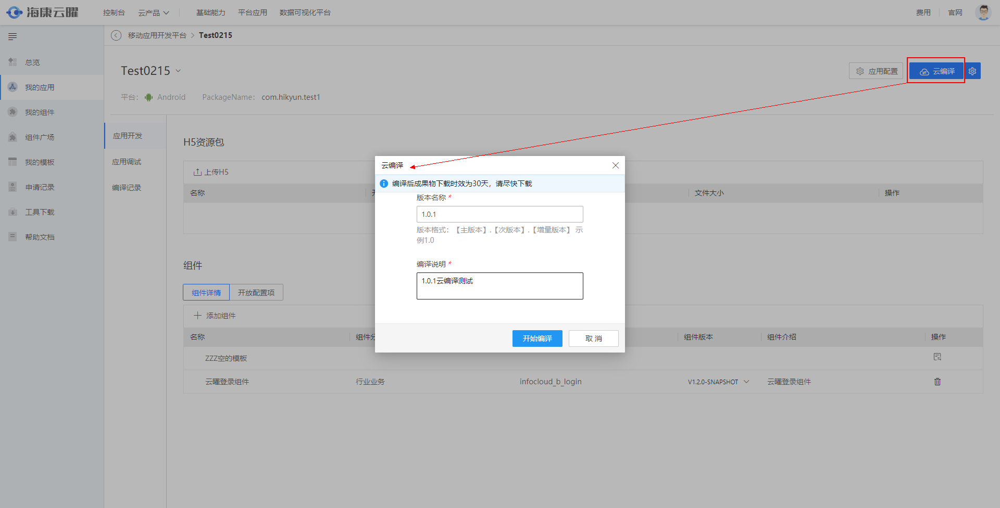

## H5应用开发

### 简介

默认你是一个成熟前端开发者，已经掌握了以下：

- node.js 环境安装
- coding工具vscode编辑器
- npm 包管理工具配置
- 掌握前端基本编码能力，熟练使用vue框架

入门的教程：

https://hitom.hikyun.com/doc/example/example.html#%E5%9F%BA%E4%BA%8Ewebview%E6%B7%B7%E5%90%88%E7%A7%BB%E5%8A%A8%E5%BA%94%E7%94%A8%E5%BC%80%E5%8F%91

<div align="left"></div>


### 开发工具

安装一个脚手架**hatom2-cli**：脚手架工具提供了一组灵活的交互命令，可以通过命令快速生成项目工程，从而避免babel、loader等繁琐的配置，使前端开发人员可以直接进行应用开发。其次，脚手架封装了hatom原生插件，不用进行额外的配置，就可以直接调用硬件设备（手机、pad等）的原生能力。同时，脚手架集成了目前比较流行的移动端UI框架，cube-ui、Vant，可以通过交互命令进行UI框架的选择，也可以选择其他的UI框架。最后，脚手架将eslint、stylelint包括了进去，这样可以更好的规范你写的代码。

```bash
npm install hatom2-cli
```

基本命令

```bash
# 查看版本
hatom -V/--version

# 帮助信息
hatom -help

# 查看所有模板
hatom list

# 工程初始化
hatom init <template> <project>
```

**使用模板**

- [spa-tpl](https://gitee.com/hatom/hatom-spa-tpl)—— 基于webapck5+vue2的hatom单页应用模板
- [spa-demo](https://gitee.com/hatom/hatom-spa-demo)—— 基于spa-tpl模板搭建的单页应用demo
- [mpa-tpl ](https://gitee.com/hatom/hatom-mpa-tpl)—— 基于webapck5+vue2搭建的多页应用模板
- [mpa-demo ](https://gitee.com/hatom/hatom-mpa-demo)—— 基于mpa-tpl模板搭建的多页应用demo
- [uni-tpl ](https://gitee.com/hatom/hatom-uni-tpl)—— 基于uni-app+uni-hatom插件搭建的应用模板 ( v2.3.0+)
- [uni-demo ](https://gitee.com/hatom/hatom-uni-demo)—— 基于uni-tpl模板搭建的uni-app应用demo ( v2.3.0+)

**开发规范**

文档教程 https://hitom.hikyun.com/doc/v3/h5-developer/H5-cli.html#%E4%BD%BF%E7%94%A8

**基础配置**

webApp.json：zip包的基本信息

pageRouter.json：应用内路由入口规则

### 调试工具

制作工具：简易的浏览器

<div align="left"></div>


### 能力插件

通用插件： https://hitom.hikyun.com/doc/v3/plugin/

业务插件： 资源广场

插件示例：文件上传、

其他框架兼容：

hatom-js插件——基础引擎配置

https://hitom.hikyun.com/doc/example/plugin-exp/plugin3.html


### 制作APK

平台区分内、外部用户

- 已经注册的老用户，默认都为内部用户。内部用户再未登记域账号前，需要登记域账号和联系方式，联系 刘昊17 审核通过后，方可正常进入平台使用。
- 新注册的用户默认均为外部用户，如需转为内部用户需联系 程璐5 修改用户类型。

使用的步骤流程如下

<div align="left"></div>

最后的作用体现于：

- 支持在线打包 Android和iOS App
- 支持上传或一键生成签名证书
- 组件提供开放配置项，让组件可支持用户动态配置
- 支持应用名称、应用图标、启动页等个性化配置
- 打包任务支持智能调度

##### 云编译配置

<div align="left"></div>

注意事项：

- 根据公司应用分发平台内部应用管理规定，所有在应用分发平台上架的APP，编译完成的成果物APK需要手动上传到[移动开发签名管理服务](http://mams.hikvision.com.cn/)进行签名后,才能发布到移动应用分发平台上。

- 关闭签名，云编译打包的成果物APK需要手动上传到[移动开发签名管理服务](http://mams.hikvision.com.cn/)进行签名，否则APK在设备上无法安装。

- 打开签名，则成果物APK自签名，不做应用分发平台的签名校验，APK可正常安装。

##### 构建云编译任务

所有配置完成后，需要构建云编译任务并开始编译

<div align="left"></div>

##### 云编译成果物

云编译成功后，可以下载成果物，主要有两种方式：扫描二维码下载和直接下载到本地。


