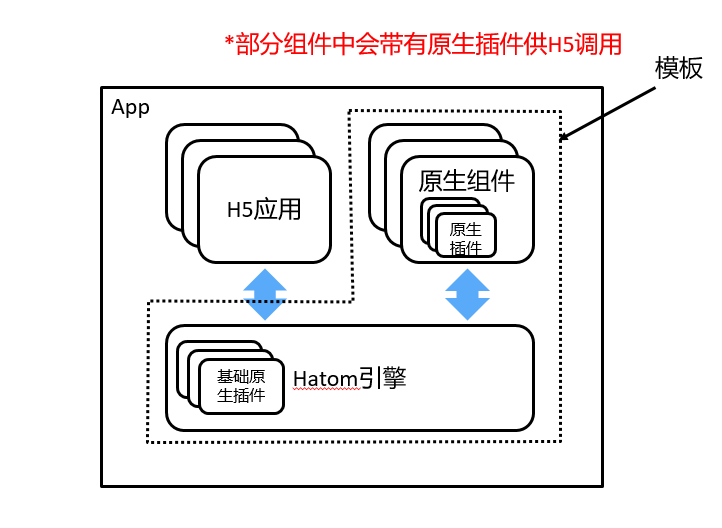
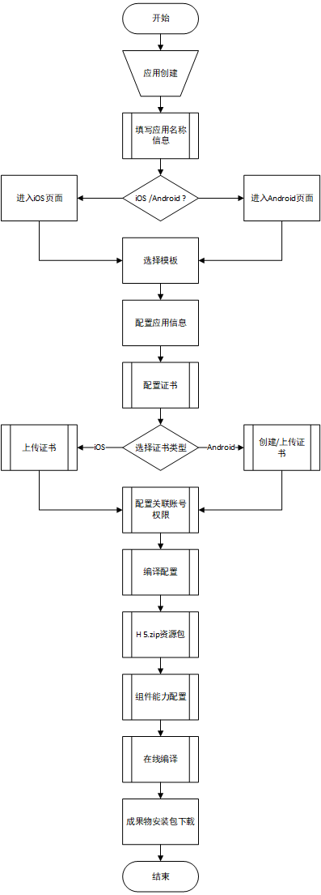

# Hatom使用手册

## 移动应用开发平台

### 简介

​		这里主要讲一下移动应用开发平台的产品的背景、定位以及功能的介绍。

#### 背景

​		公司各个区域都有移动端需求，但是每个区域每年的移动端定制需求又不多。各个区域没有移动端开发，研发主要以java后端和Web前端为主，杭州总部的移动端开发人数有限无法满足全国的业务需求，截取的某个年度需求项目如下图：

#### 产品定位

​		Hatom 移动应用开发平台是一个开发APP的低代码研发平台，我们将自己研发移动应用的核心服务能力抽取出来进行服务化，开放自己的商业能力，助力合作伙伴，构建面向未来的研发生态，满足业务快速迭代的需求。我们使用了流行的Html5前端技术+平台海量组件，通过简单的配置，即可完成业务应用的搭建，无需掌握Android和iOS开发技术，即可快速、灵活的构建移动应用，满足企业个性化需求，降低APP开发难度，提升APP交付效率。

#### 功能介绍

​		采取H5 **+** 原生的模式开发Hybrid App，使用原生开发的插件提供手机原生能力，使用H5开发的页面实现业务功能，移动应用开发平台提供云编译能力（线上打包App）。同时随着移动app开发技术的成熟，目前市场上支持跨端开发的框架层出不穷，当前国内最受欢迎的是DClound推出的uni-app框架。为了方便hatom框架的开发者的使用，hatom云编译服务引入了uni-app引擎，支持uni-app小程序成果物zip, 打包apk。

#### 产品优势

- 资源复用，降本增效

  复用web前端开发资源,使用H5进行开发，需求响应快，沟通效率高。

- 建立规范，整合能力

  建立H5开发移动端规范，提供完善的文档，搭建组件市场让原生能力灵活使用,提供工程脚手架简化开发流程。

- 统一构建，提升效率

  搭建在线构建环境，支持Android，iOS，快速自动化构建。

### 开始

​		目前移动应用开发平台是基于云曜互联网智能应用平台搭建的，使用平台的账号与进入平台的入口分别都在云曜的官网与控制台中。

#### 注册云曜的账号

在云曜的[官网](https://www.hikyun.com/index)中，点击右上角的**免费注册**按钮。

进入到账号注册页面

#### 登录云曜

注册成功之后，登录成功之后进入控制台

#### 进入平台

点击控制台的云产品，进入移动应用开发平台

进入移动应用开发平台首页

### 框架

​		平台的业务上承HiDO组件应用市场，下接应用分发平台。中间分为平台和终端两个部分，其中平台业务的成果物输出成果物为终端模块。平台部分为开发支撑和管理运营两个模块，终端分为操作系统、引擎容器、UI层资源包三层。

#### 平台构架

​		平台基于云曜互联网智能应用平台搭建，分为开发支撑和管理运营两个部分，分别对应为开发者账号和管理员账号。开发者账号主要模块是组件、模板、应用管理几个功能。此节不做详细说明，详见后面的相关章节。通过打包服务将前面的几个模块编译打包、安全加固输出为终端成果物。管理员账号的主要功能除了开发者账号的功能之外，还有管理与运营功能相关用户管理、组件管理、资源管理、运营分析等模块。

#### 终端构架

​		终端构架的如下，主要在于复用web前端开发资源快速构建App，其中分为UI层、容器、OS层。OS层分为安卓、iOS、HarmonyOS等操作系统，在平台构架中的壳工程和打包服务中完成架构。容器层分为webview引擎、uni-app引擎、以及其他原生组件。原生组件分为能力组件、业务组件，自定义原生组件。UI层中分为H5端页面+原生页面，H5页面带有jsBridge.js交互中间件 + Hatom 注册的API函数，原生页面带有的是原生端开发好共性业务组件、定制业务组件等自带的开发好的页面。

### 组件

#### 介绍

 **组件** 在词条上的解释是：数据和方法的简单封装，是一个组装单元，它具有约定式规范的[接口](https://baike.baidu.com/item/接口?fromModule=lemma_inlink)，以及明确的依赖环境。构建可以被独立的部署，由第三方组装。但在不同的场景有不通的理解， 在web前端的vue中是页面UI中划分为独立的、可重用的部分，并且可以对每个部分进行单独的思考封装成的能力，在服务端的微服务中是根据业务封装的API接口形成的单个jar包，在客户端中就是封装好的能力插件与业务组件。可以是表格控件、报表控件、用户界面控件等。最后在移动应用开发平台中体现的就是： 服务化的核心服务能力， 可以是设备能力组件、共性业务组件，自定义封装的能力插件、业务组件。

#### 作用

组件在平台上的作用

- 用户可按需灵活选取组件组成App；
- 提供常用模板（组件根据不同场景的组合）帮助用户快速选定App壳应用；
- 提供了支持云曜、域见、云远构架的各类原生组件（例如：视频预览回放等）；
- 支持移动端开发自定义组件和自定义模板参与App构建，自定义组件和自定义模板通过审核后可发布到组件市场供其他用户使用。

构架如下图：

#### 组件管理

 组件的管理模块总体构架如下图：

#### 组件配置

组件配置分为开发配置项，组件API、路由、菜单配置。其中菜单配置与组件的构架相关，无构架下无菜单配置

##### 开发配置项

开发配置项，当组件的能力需要配置参数，需要提前将参数的配置项开放出来，如下图：

##### API、路由、菜单配置

当业务组件内封装了API、路由以及菜单。在组件详情页的配置内容，在组件的应用中，可以被应用的UI层以及其他的资源包进行对接，如下图：

#### 组件使用

组件的使用有两个前提是：组件被发布或被授权使用、应用的负责人与组件作者是同一个人。

##### 组件的发布

组件发布如下图点击发布按钮，填写发布说明点击确定按钮提交之后，进入发布审核流程，管理员审核成功之后，进入到组件广场，可以被授权、被收藏

##### 组件的引用

进入应用详情，进入应用开发tab，点击组件列表的添加按钮，进入组件列表后，选择版本，添加完成之后，将组件与应用进行绑定。

### 模板

#### 介绍

**模板**在词条上的解释是将一个事物的结构规律予以固定化、标准化的成果，它体现的是结构形式的标准化。在平台中是，将具有共同业务的组件配置成常用的应用模板，您只需要根据应用属性选择模板，然后上传您的H5应用，即可编译出移动应用。其作用如下图：

#### 作用

​		模板管理负责处理hatom平台创建发布的应用模板，模板主要是一系列组件的集合，旨在简化用户配置app应用时选择组件的困难，帮助用户更有针对性的配置app功能组件，提高用户开发app的效率。在平台中的构架如下：

#### 使用

我们已经在平台上配置了常用的应用模板，您只需要根据应用属性选择模板，然后上传您的H5应用，即可编译出移动应用。

##### 模板管理

在平台中使用结构 如下图：

模板的创建如下图：

模板组件的关联如下图：

##### 模板发布

模板发布如下图点击发布按钮，填写发布说明点击确定按钮提交之后，进入发布审核流程，管理员审核成功之后，进入到模板广场，可以被授权使用

##### 模板使用

### 平台能力

#### 介绍

平台提供的核心能力

**1**、组件市场——提供各类移动端原生能力组件（整合移动端基础能力和海康各构架共性业务能力）；

**2**、云编译——支持**iOS**和**Android**线上打包，无需搭建移动端开发环境；

**3**、Hatom框架——一次编码开发**Android**、**iOS**跨平台App

#### 用户

平台区分内、外部用户

- 已经注册的老用户，默认都为内部用户。内部用户再未登记域账号前，需要登记域账号和联系方式，联系 刘昊17 审核通过后，方可正常进入平台使用。

- 新注册的用户默认均为外部用户，如需转为内部用户需联系 胡安安 修改用户类型。

#### 使用

使用的步骤流程如下

##### 

### 云编译

#### 介绍

​		云编译主要是由打包服务提供将app应用的编译打包，其中跟编译打包相关的app工程构建构建、组件依赖下载、配置项修改、app信息等的修改、加固、混淆等均由打包服务完成，此外安卓签名证书的一键生成、iOS组件的上传发布、组件的验证、模板的验证等也由打包来完成， 时序图如下：

#### 作用

​		打包服务(hatombuilder)对后端服务(hatom)暴露的是所提供的服务的restful接口，其中包括编译任务接口、组件/模板验证接口、安卓签名证书创建接口、iOS组件发布接口、组件版本检测接口、编译服务状态接口等，此外打包服务需要在启动时主动注册的consul网关，才能被后端服务（hatom）发现调用。

​		打包服务在接受到后端接口调用时，根据接口类型选择创建任务提交任务池处理还是立即处理。立即处理的任务，等待执行完毕即时返回接口调用；提交任务池的任务在任务执行完成时，通过后端提供的状态同步接口，同步任务执行结果到后端。

最后的作用体现于：

- 支持在线打包 Android和iOS App
- 支持上传或一键生成签名证书
- 组件提供开放配置项，让组件可支持用户动态配置
- 支持应用名称、应用图标、启动页等个性化配置
- 打包任务支持智能调度

#### 使用

##### 云编译配置

注意事项：

- 根据公司应用分发平台内部应用管理规定，所有在应用分发平台上架的APP，编译完成的成果物APK需要手动上传到[移动开发签名管理服务](http://mams.hikvision.com.cn/)进行签名后,才能发布到移动应用分发平台上。

- 关闭签名，云编译打包的成果物APK需要手动上传到[移动开发签名管理服务](http://mams.hikvision.com.cn/)进行签名，否则APK在设备上无法安装。

- 打开签名，则成果物APK自签名，不做应用分发平台的签名校验，APK可正常安装。

##### 构建云编译任务

所有配置完成后，需要构建云编译任务并开始编译

##### 云编译成果物

云编译成功后，可以下载成果物，主要有两种方式：扫描二维码下载和直接下载到本地。

### 工具

#### 介绍

​		提供工具的作用主要是调试，分为组件调试、应用调试。工具的提供是在应用调试模块，主要场景在于用户在平台开发应用时调试所用。用户可以使用该模块编译打包调试app，并测试验证调试app中组件所包含的API和路由功能。

#### 使用

​		平台的工具来源是工具下载模块，以及在应用详情页中的调试页面编译出的调试安装包。工具下载模块提供了几个工具，ifar(云远)调试工具、isee(域见)调试工具、无构架远程调试工具，如下图：

扫码下载apk，安装在手机设备后，就可以调试相关构架的基本功能调试。 以上的工具仅仅只是基本工具，若是想调试其他的

### 帮助文档

### 更新日志

## H5应用开发

### 简介

### 开始

### 代码构成

### 宿主环境

### 基础配置

### 基础插件

### 开放能力

### 应用调试

### 性能与体验

## 插件使用

hatom移动应用开发模式是混合模式开发，采用原生端webview容器+前端静态资源html页面+webviewJavaScriptBridge.js。插件使用场景如下：

 hatom插件构架图

### 文件上传示例

### 新增插件示例

### 兼容跨平台示例

## 开发案例

