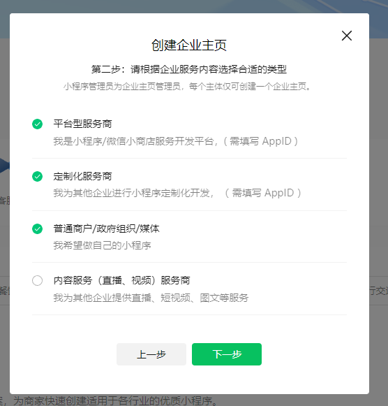
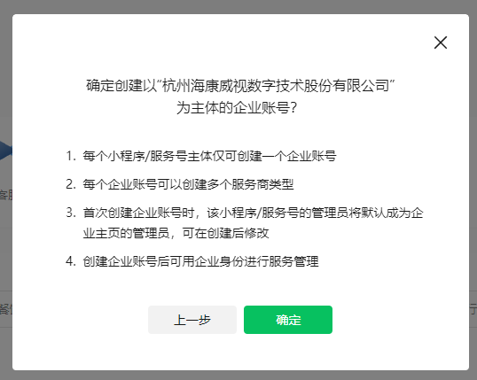
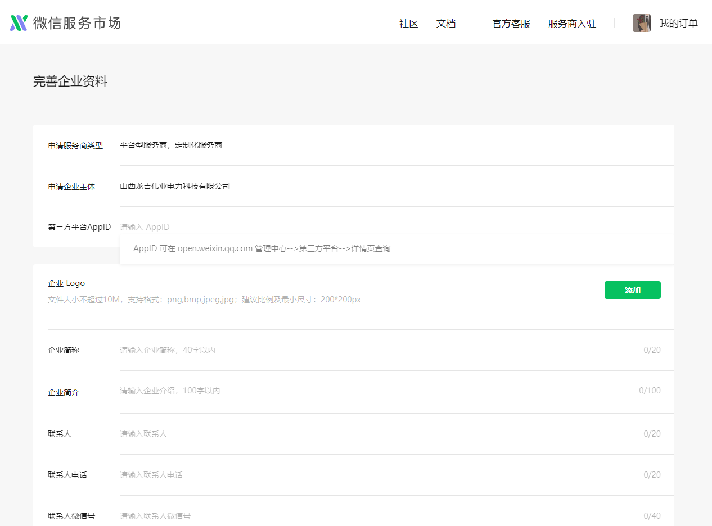
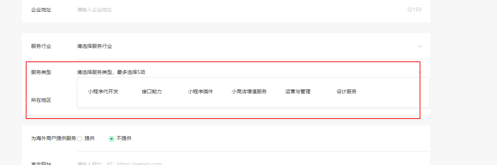

## 小程序子模块多包集成案例调研

### 前言

​		项目开发中，分模块开发已成开发中常规方式。某个项目小程序中，可以根据登录的账号角色以及权限，加载各个不同业务的子模块，各个子模块的开发可以根据业务分散在各个业务组的开发人员中。如此可以根据项目场景灵活、快速组装好各个子模块，发布一个新的小程序。那么将各个子模块快速集成到目标主程序中，需要一个评估方案，也成为一个亟待解决的问题。

### 目标

​		解决小程序快速集成其他子模块资源，需要快速找到以下：

- 小程序可以跳转、加载、嵌入的资源类型

- 微信端可以发布成果物的几种类型

### 设计

​		查询微信文档，可知以下,小程序可以跳转、加载、嵌入的资源类型：小程序跳转小程序、小程序加载H5静态资源、小程序嵌入功能插件,微信端可以发布成果物的几种类型：小程序、公众号、插件、小游戏（排除）。得到以下几种方案，

1. 小程序跳转小程序路由 

   ```javascript
   wx.navigateToMiniProgram(Object object)
   ```

   

2. 小程序嵌入微信公众号页面 

   ```js
   new cloud.Cloud({
     appid: '公众号 AppID',
     resourceAppid: '小程序 AppID',
     resourceEnv: 'a', // 资源方云环境 ID
     traceUser: true,
   })
   ```

3. 小程序加载web/H5 静态资源 (web-view)

   

4. 小程序调用插件

   hikyunHatom

### 探究方案一

小程序跳转小程序路由，采用Api  ```   wx.navigateToMiniProgram(Object object) ```, 但交互体验不是很好，有弹窗提示

如下图：


### 探究方案二

需要注册公众号，每开发一个模块就要向微信注册一个公众号，同时接入公众号的流程，开发流程与公众号开发类似

### 探究方案三

小程序加载web/H5 静态资源 (web-view)， 这个方案前提条件较多

- 条件一：嵌入的页面链接必须是正规的网站域名（已备案）

- 条件二：需要在小程序后台下载公钥文件，并上传到网站根目录

- 条件三：嵌入的网页不能再次跨域名跳转，且无法随意调用开放API，如打开相机、扫码、文件读写等接口

- 条件四：使用腾讯云开发，托管静态资源建站，需要付费同时申请腾讯云域名账号，但可以跳过以上条件（无需校验条件二、三）

尽可作为简单浏览器页面嵌入，无法开发复杂的交互功能

### 探究方案四

开发小程序插件，小程序插件开发需要资质条件

#### 限制

- 条件一：申请的小程序需要特殊的类目

  <div style="width:100%">
      
  </div>

  <div style="width:100%">
      
  </div>

  <div style="width:100%">
      
  </div>

  

- 条件二： 小程序个人订阅号无开发插件资质

- 条件三：插件内部管理http网络限制，需要额外开发接口申请网络签名，10分钟变更一次签名， 未来可能会被作为卡子，限制使用

  

#### 优势

优势可以将插件发布到插件市场，公开给第三方使用，可以作为服务商接入微信服务市场，可以发布不同类型的小程序、插件、模板。入驻[微信服务商](https://fuwu.weixin.qq.com/?code=-10006)

#### 渠道

探究以下需要对接商务流程，权限不够暂未做探究。

<div style="text-align:center; display:flex">
    
    
</div>

<div style="text-align:center; display:flex">
    
</div>

<div style="text-align:center; display:flex">
    
</div>


### 其他思路

步骤一：开发主小程序作为主工程壳子，可以发布到微信平台中

步骤二：定义新的插件开发规范，按照规范开发出子模块，将子模块代码上传到仓库

步骤三：平台管理中心通过管理工具，将子模块代码，按照规范合并到主工程的壳子中

步骤四：将合并好的主工程壳子，通过微信SDK打包上传到微信小程序中，发布新的小程序版本

该方式投入的资源较大，但开发生态最为完整，需要预估市场前景，进行评估。前期可以考虑简易的脚本工具进行代码合并。

​	

