## 移动应用开发平台文档问题反馈

移动应用开发平台2.0上线之后，作为前端的负责人，一直在对接交流群内的问题反馈，将反馈的问题如下：

  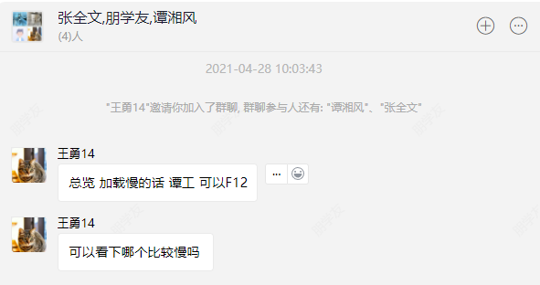
  

  
  

经过第一次优化之后，使用vuepress重构，将文档模块内容重构了

  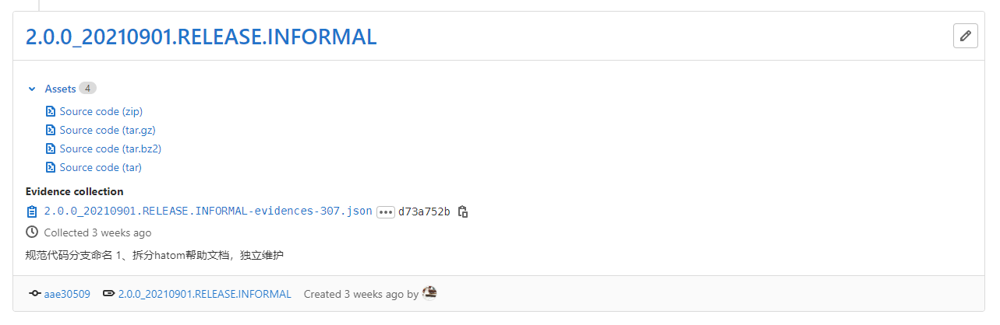

  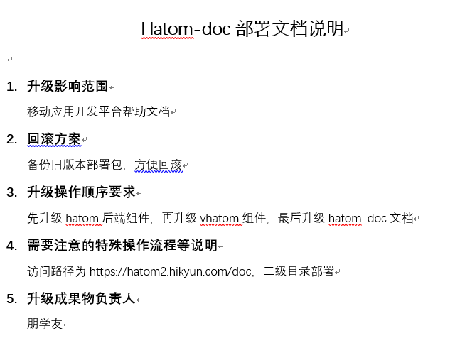

  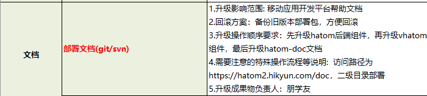
  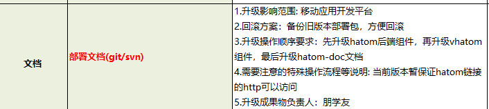

  
  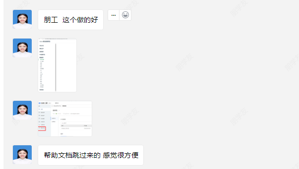

经过第三次交互重构之后，经过文档评审之后

  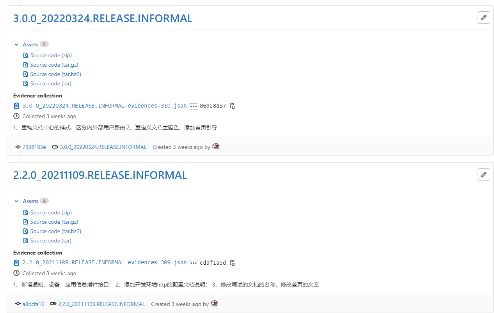

  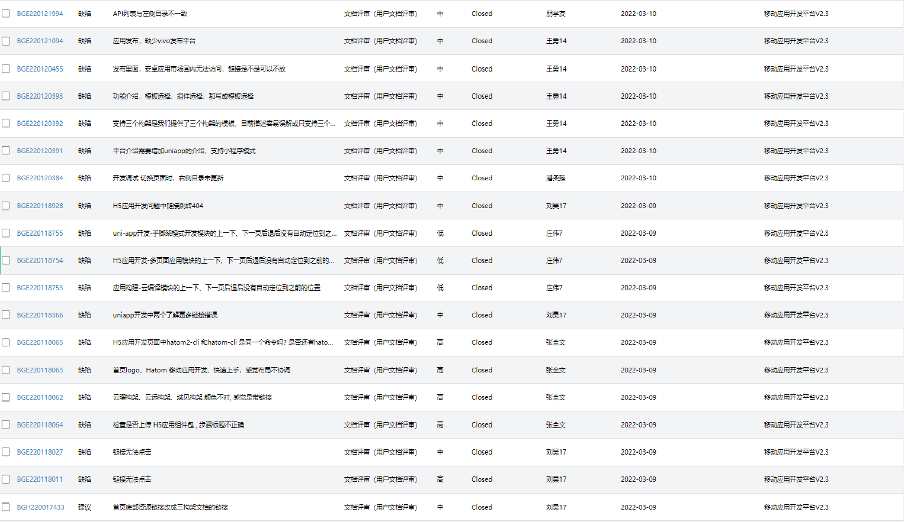

  

  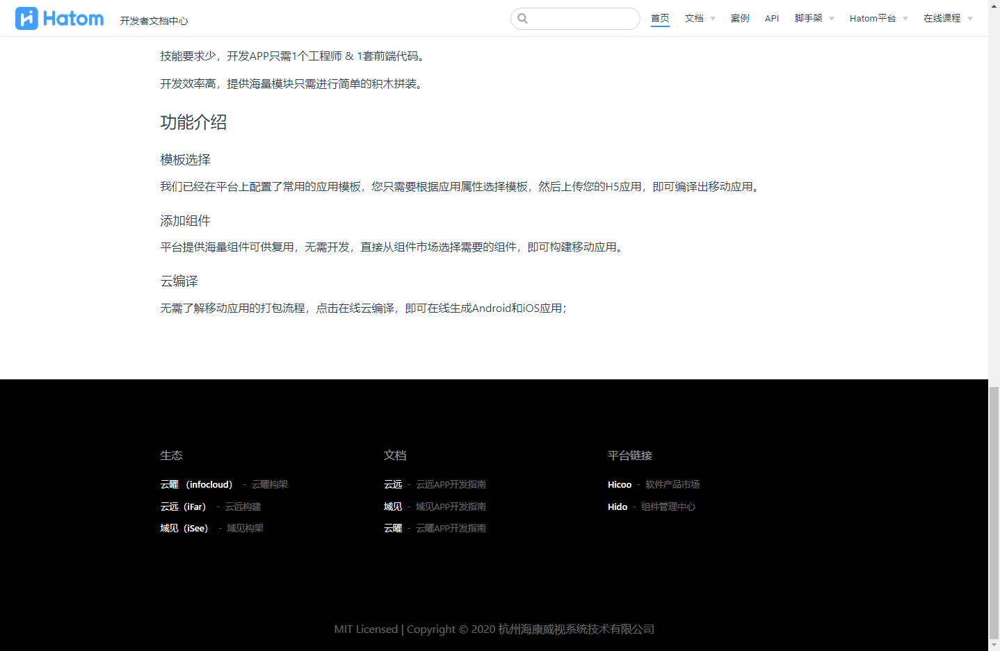

  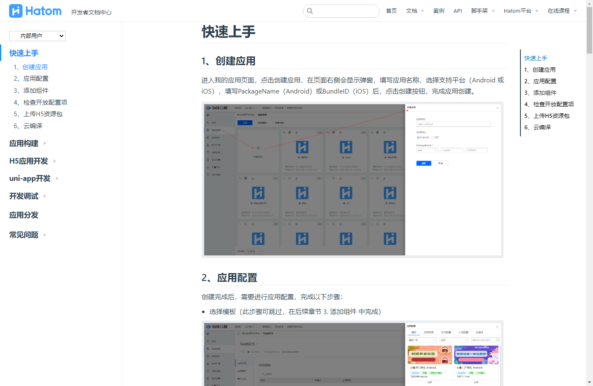

  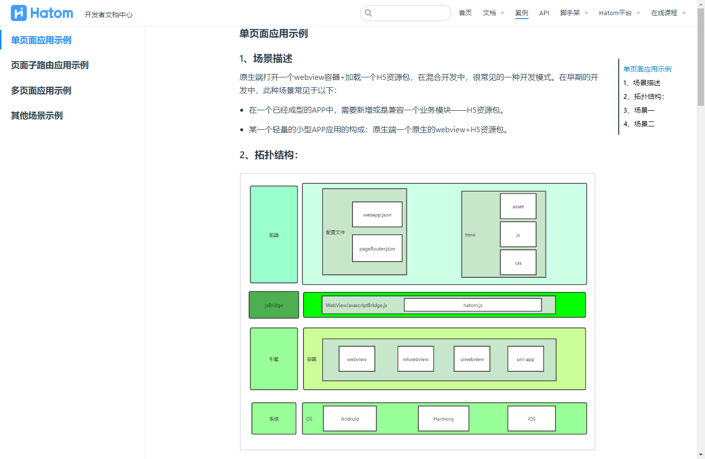

  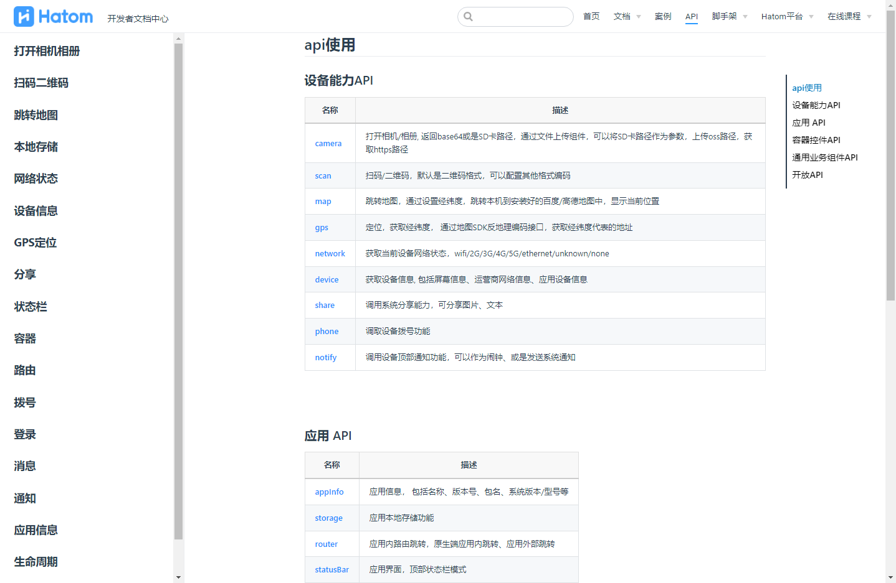

优化之后的成果性能测试如下：

  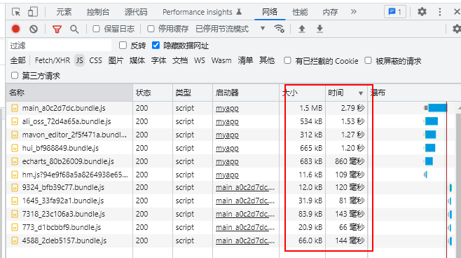

