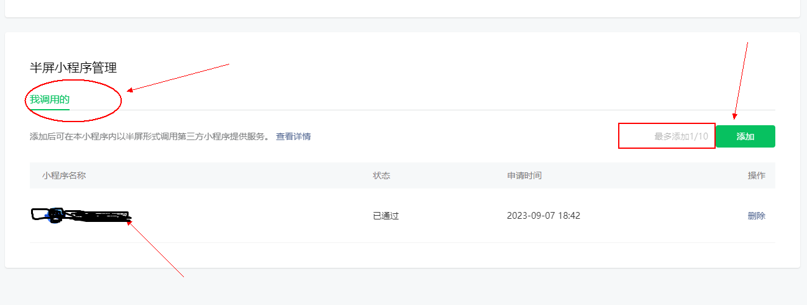
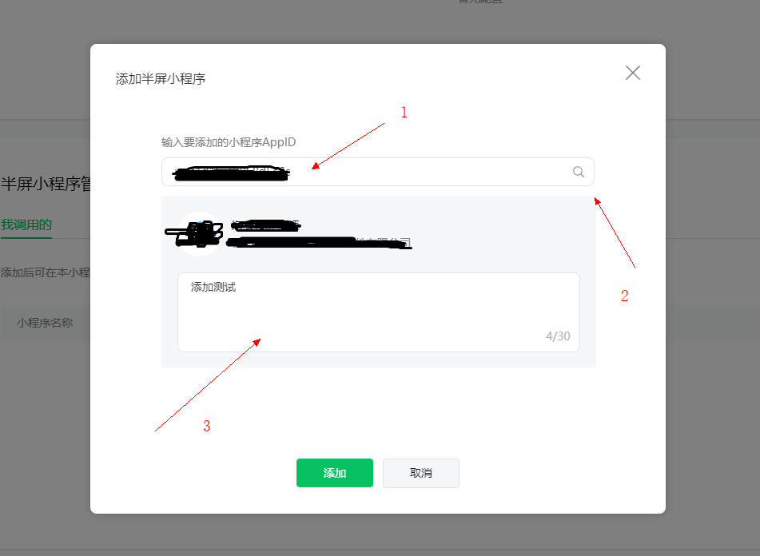
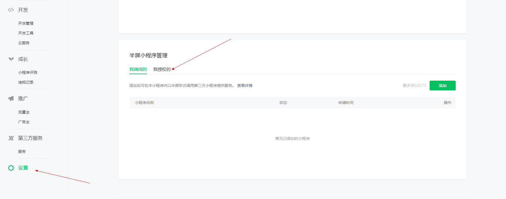
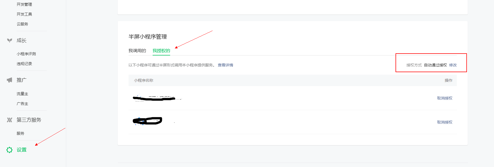
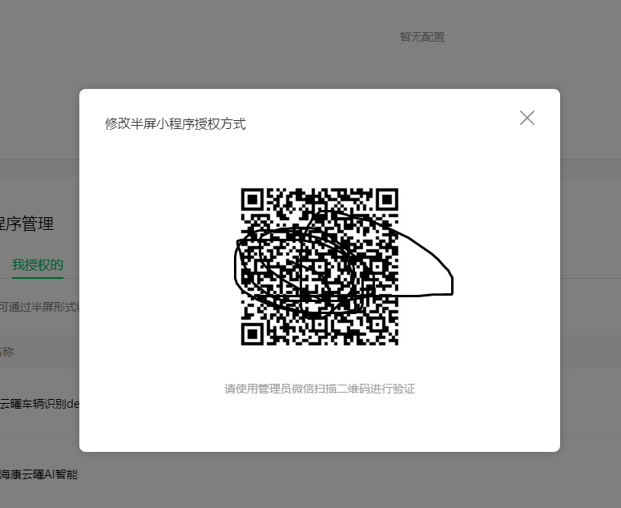
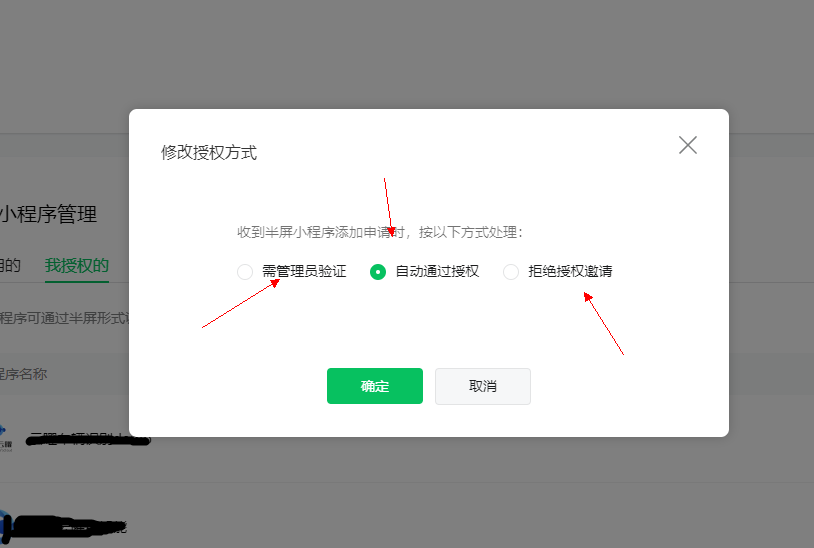
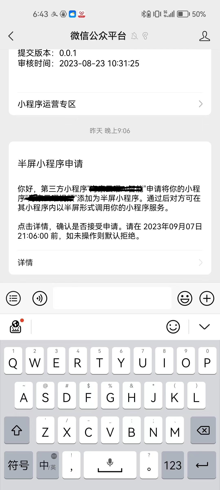
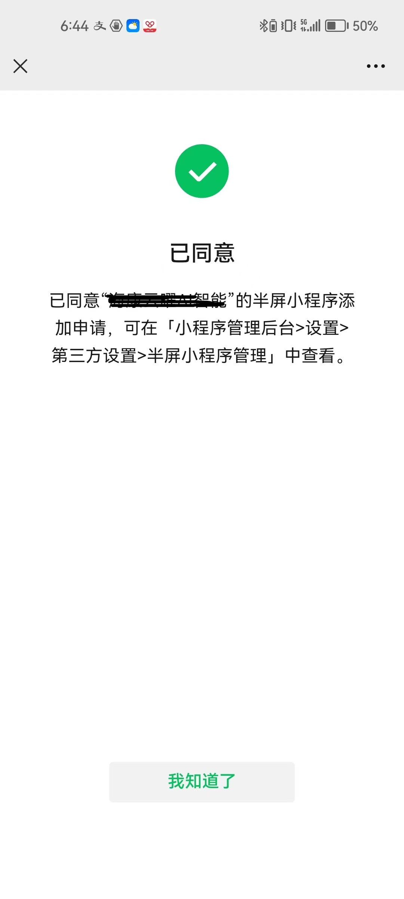
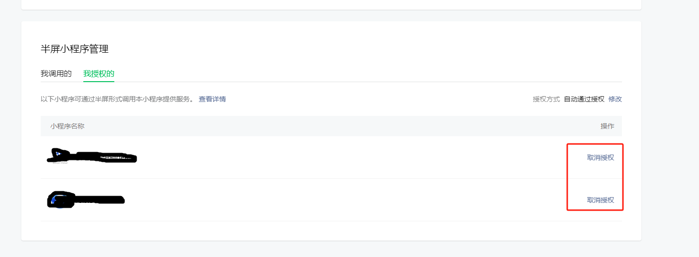
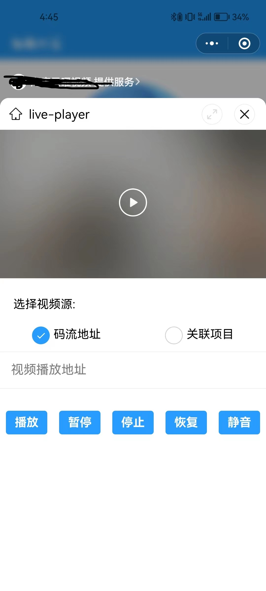

查询微信文档，微信端可以发布成果物的几种类型：**小程序**、**公众号**、**插件**、小游戏（暂排除）。同时小程序之间 跳转、加载、嵌入的类型：**小程序跳转小程序**、**小程序加载H5静态资源**、**小程序嵌入功能插件**；其中嵌入半屏小程序功能首次推出在 21年10月份，功能成熟在22年3月份、2023年6月份支持可以全屏嵌入。

### 一、嵌入的小程序

1、个人账号/未认证的账号可以申请 10个小程序嵌入

    

第三方设置->半屏小程序管理中，输入appId 进行

    

第三方设置->半屏小程序管理中，我授权的

    

    

    

    

    

    

    

    

