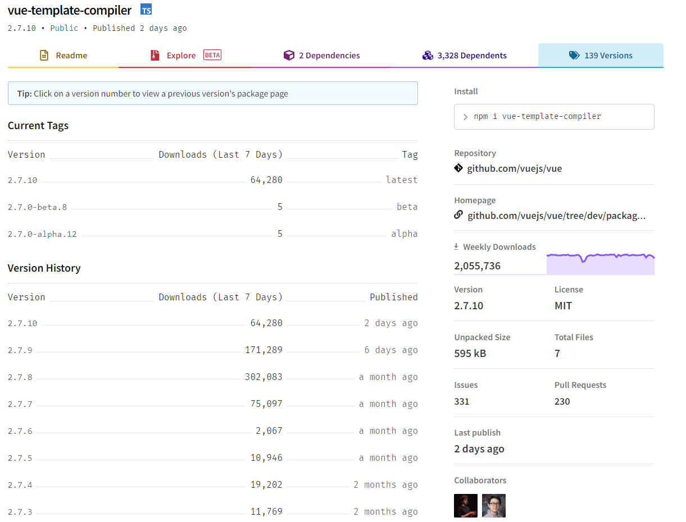
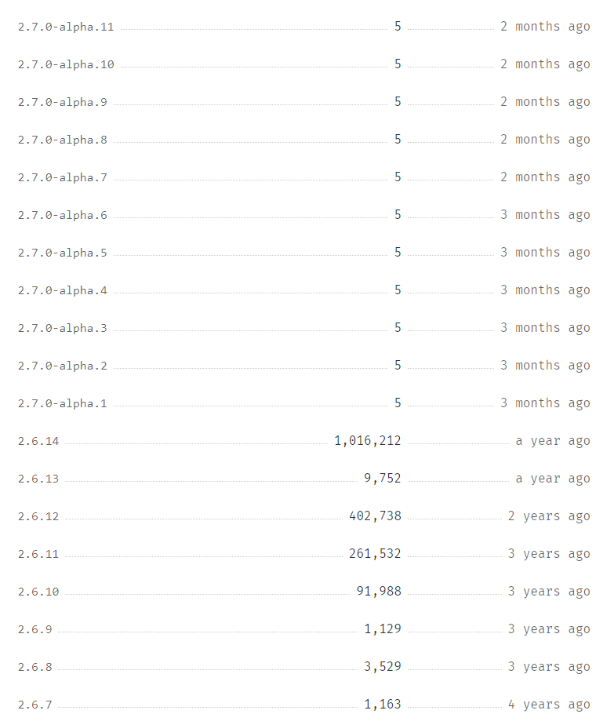
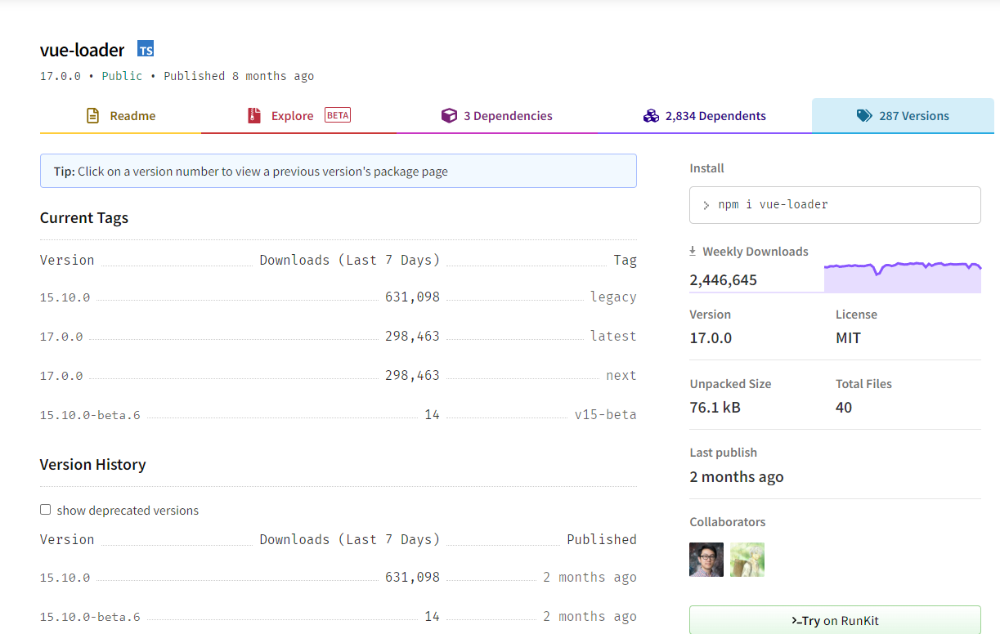
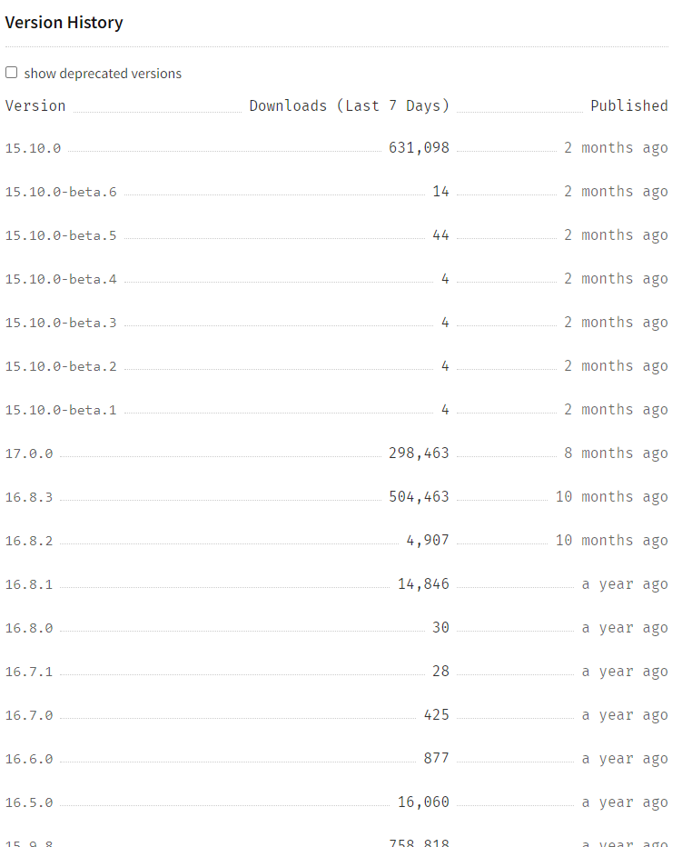

## 老项目vue2.x误用了vue3的插件问题 

### 背景	

​	    vue3出来两年了，它刚出来的时候，vue3相比vue2似乎并没有想像中那样受大家欢迎。因为两个版本的构架上相差太大了，许多的API都不兼容，其许多的争议到现在一直存在。在这里抛弃其其他的争议，仅就vue生态圈的插件升级问题，这一点确实坑到我了，很多的新项目或许还能接受vue3.0。但公司中的老项目的迁移工作量极大，仍需要继续维护vue2.X。

###  插件

​		针对项目迁移工作来说，许多的api需要自己手动实现转换，同时一些支持2.0插件在vue3中不能用了。例如$on、$off的api不能用了，在插件vue-template-compiler与vue-loader的版本上一不小心，也会踩到坑，以下主要说的是这两个插件。

###  vue-template-compiler

​		首先**vue-template-compiler**这个插件，在vue3.0之后有替代的插件**@vue/compiler-sfc**，Vue3也与这个插件琴瑟和鸣。在vue2中，原来的vue-template-compiler咋办呢？插件作者针对vue3的支持，也迟迟未更新，为了让用户丝滑的切换，尤大大亲自上手了，如下图，更新了vue-template-compiler插件的版本2.7.x，**vue-template-compiler在2.6.14版本之前是支持vue2.x的，2.7开始之后加上了vue3的兼容**。

<div style="text-align:center">
    
</div>

弄清楚以上插件版本更新后，发现的问题是老项目的package.json中安装的插件版本的锁定，默认使用^锁定大版本，次版本的版本用~ 如下图：

```json
    "vue-template-compiler": "~2.6.6",
    "webpack": "^5.4.0",
```

​     在默认package-lock.json文件共享的情况下也没毛病，问题是一旦package-lock.json这个文件删除了，npm install 下会默认给升级了次版本，这就尴尬了，老项目直接报错了，报了vue3的错误

```bash
[@vue/compiler-sfc] ::v-deep usage as a combinator has been deprecated. Use :deep(<inner-selector>) instead.
```

在使用vue2项目中，**vue-template-compiler插件最为适合的版本是[2.6.14](https://www.npmjs.com/package/vue-template-compiler/v/2.6.14)， vue3的语法编译就在2.7版本以上**，以下是插件迭代的截图：

<div style="text-align:center">
    
</div>


### vue-loader

​		同样的是vue-loader, 老老实实用16+来区别也没毛病， 问题是最近这个插件推出了15.10.x-beta版本，同样会有以上问题，有时候还会莫名其妙的问题。所以在使用vue2项目中，**vue-loader插件最为适合的版本是[15.9.8](https://www.npmjs.com/package/vue-loader/v/15.9.8)， vue3的语法编译就在[15.10.0](https://www.npmjs.com/package/vue-loader/v/15.10.0)以及版本以上**，以下是插件迭代的截图：

<div style="text-align:center">
    
</div>

以下是vue-loader插件的迭代图

<div style="text-align:center">
    
</div>


### 问题回溯

​		发生的原因是删除了package-lock.json，破坏了项目原有依赖树的接口，需要重新安装依赖。 因为package.json中的插件使用的是^ , 锁定的是大版本，安装依赖时会默认拉取最新的次版本，更新了插件的版本。

### 总结

总结经验，牢记坑点：

1、共享package-lock.json文件， 不要手贱去删除它

2、组件版本变更要留意，特别是核心插件大版本升级与小版本的升级