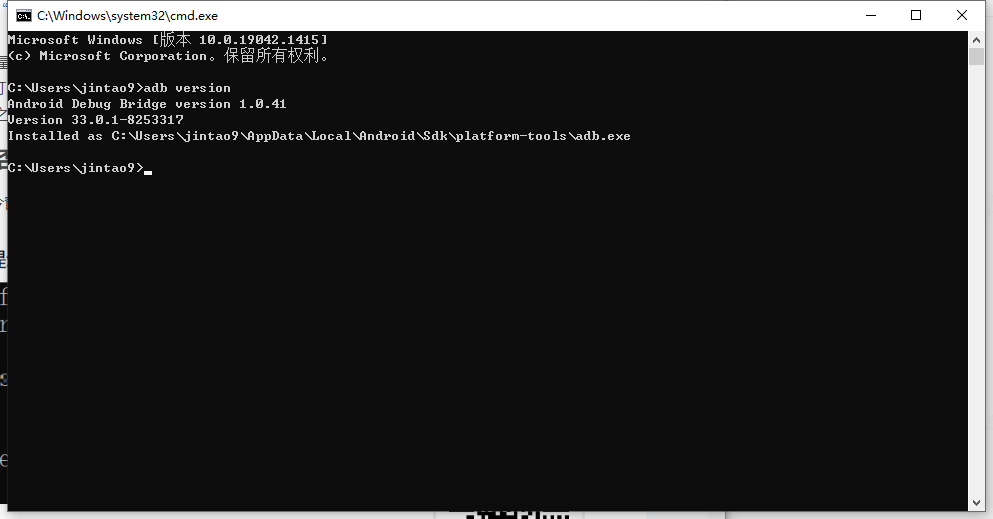

## 二维码扫描盒/枪对接

### 前言

二维码应用非常广泛，使用场景有：手机上网、个人名片、凭证类、溯源类、数据防伪等等，如下图：

<div style="width: 100%; display: flex; justify-content: space-around">
    
    
</div>
<div style="text-align: center">
 图1.1 扫码枪/盒子
</div>  

使用也非常简单，外接USB接口,  如下图，以下就是我对接的盒子

<div style="text-align: center">
    
</div>
<div style="text-align: center">
 图1.2 扫码枪/盒子
</div> 


### 原理

​		拿到二维码阅读器盒子，附带一个使用说明书，记得一定要先阅读说明书，这个很重要！这里会有两个模式，一个是USB虚拟串口模式（需要安装相应的驱动程序），一个是USB-HID模式（默认）。大多数都采用的是默认的HID试模式，我这边也是默认的HID模式。

​		将扫码器USB插入设备，扫码器一般会有指示灯光亮起，或是蜂鸣“嘀”一声，标识设备已初始化成功。然后在设备上打开任意可以输入的文本或是控件，例如：记事本、文本框，浏览器输入框。将任意测试的二维码，对准扫码器，听到扫码器“滴”一声提示扫码成功，那么可以看到设备文本框或是控件上，一个字符一个字符慢慢的出现二维码内容。

<div style="text-align: center">
    
</div>
<div style="text-align: center">
 图2.1 扫码枪返回结果
</div> 

以上可以看到，扫码枪/盒子在USB-HID模式下，会劫持设备系统的键盘输入事件，将二维码内容通道键盘输入事件的通道传入设备。

### 应用场景

​		在web前端中查阅API，键盘事件**`KeyboardEvent`**描述了用户与键盘的交互。 每个事件都描述了用户与一个按键（或一个按键和修饰键的组合）的单个交互；事件类型`keydown`，`keypress` 与 `keyup` 用于识别不同的键盘活动类型。从keydown、keypress、keyup三种类型中最终选择keydown事件。`keydown`对象如下图所示：

<div style="text-align: center">
    
</div>
<div style="text-align: center">
 图2.2 KeyboardEvent返回对象
</div> 

#### **场景一**：

在document或是window上添加事件监听，这里使用的是addEventListener事件的API，有一个注意点，就是removeEventListener的对应使用。

```javascript
created () {
    // 解决重复监听
    document.removeEventListener('keydown', this.handleKeydown, true)
    // 添加事件监听
    document.addEventListener('keydown', this.handleKeydown, true)
}
```

```javascript
handleKeydown (event) {
    // 处理KeyboardEvent事件
    console.log(event)
    if (event.key && event.key.length === 1) {
       this.qrcodeStr += event.key
    }
    if (event.key === 'Enter') {
        console.log('==扫码结果===', this.QrcodeStr)
    }
}
```

该场景是一个应用内的全局监听，适用于简单的场景。不过要注意的`缺陷`是，**应用内的所有input输入框，都会触发这个监听回调**。

#### **场景二**：

添加一个input输入框，将KeyboardEvent对接到该聚焦的输入框。

<div style="text-align: center">
    
</div>
<div style="text-align: center">
 图3.1 添加输入框
</div> 


```html
<template>
    <input ref="inputData" size="large" placeholder="请输入" @blur="inputBlur" @compositionstart.native="compositionstart" />
</template>
```

```javascript
created () {
    // 自动聚焦
    this.keyPress()
},
methods: {  
    keyPress () {
        // nextTick 针对DOM 没有渲染出现Undefined问题
        this.$nextTick(() => {
            this.$refs.inputdata.focus()
        })
    },
    compositionstart (val) {
        //当用户使用拼音输入法开始输入汉字时，这个事件就会被触发
       console.log('===compositionstart==', val)
    },
    inputBlur (val) {
        console.log('===inputBlur==', val)
        const that = this
        // FireFox 和 IE 失去焦点，blur直接执行focus 不会生效，加个延时
        setTimeout(() => {
            that.$refs.inputdata.focus()
        }, 10)
    },
}
```

### 项目应用

​		根据项目测温访客机5032型号应用访客系统客户端，需求中需要扫码枪将识别健康码信息回传入应用中，通过接口传入健康码系统做健康码信息查询，同时场景一模式适合需求。为了解决场景一的缺陷，思考了一下，考虑到有以下两种方式。

#### **方式一：**

​		单独处理input控件，做一个自定义的input组件注册，在input自带的focus以及blur事件中做一个拦截。在focus事件中移除全局监听，在blur中恢复监听，将页面内的所有的input控件替换掉，全部使用这个自定义的input。

```javascript
blur () {
   document.addEventListener('keydown', this.handleKeydown, true)
},
focus () {
  document.removeEventListener('keydown', this.handleKeydown, true)
}
```

#### **方式二：**

​		基于程序的延展性与复杂性考虑，方式一不是很适合。回到问题的最初分析，扫码枪会劫持系统的键盘输入事件，包括程序中所有的input、textarea等输入框。那么场景一中document上监听的`keydown`事件中的回调，也就成了系统输入事件的回调，包括input、textarea等。可以在该回调中再次做一个劫持过滤。如下：

```javascript
handleKeydown (event) {
  if (event.target.tagName !== 'BODY') {
    console.log(event.target.tagName)
    return
  }
  // 处理KeyboardEvent事件
  if (event.key && event.key.length === 1) {
     this.QrcodeStr += event.key
  }
  // 二维码传输结束符  
  if (event.key === 'Enter') {
    console.log('==扫码结果===', this.QrcodeStr)
  }
},
```

### 性能测试

打包提交测试，做连续的扫码的性能测试，发现会有二维码字符串有缺失问题，如下：

<div style="text-align: center">
    
</div>
<div style="text-align: center">
 图5.1 二维码测试结果
</div> 

### 分析问题

​		字符串缺失问题，先添加日志手机字符串缺失的内容，观察二维码内容缺失的字符是不是有规律。通过大量的测试数据观察，没发现规律，排除是特殊字符串传输中转码问题。接着排查字符串处理逻辑问题，去除代码中处理逻辑，继续测试排查，排除代码处理逻辑缺陷。接下来排查KeyboardEvent事件类型`keydown`，`keypress` 与 `keyup` 用于识别不同的键盘活动类型去测试，依旧还有这个字符串缺失的问题。

​		接下来从系统传输的问题排查，跳出开发的应用程序。在设备的应用里面，打开浏览器浏览器或是其他的文本输入区，聚焦的情况下，测试扫码数据，同样发现这个问题，出现在浏览器和文本输入区二维码结果字符串缺失。这个就需要探究设备系统的问题，只能去请教设备系统开发人员。

### 问题结论		

​		开发人员分析是系统传输速率问题，然后说了更多的专业术语，大致的情况是扫码器的输入输出是分开的两个线程，内部会有一个消息缓存buffer，当输出的进程与输入的速率不一致，导致buffer溢出，抛出异常的结果。。。唉？一脑子的摸不着头脑，更深的认识到隔行如隔山的障碍。最后对方给出的方案是系统需要做个版本补丁。问题的下一阶段就是交给他，等他将系统新版本的安装包交付提出来，然后对设备进行刷机，重新安装系统。

总结是：需要在系统的IO中添加buffer，使之延长，减缓这个速率问题。最后就是刷机安装系统的步骤，需要自己亲自动手去实践了。

### 解决新问题

​		设备刷机，系统升级的问题，本人在web前端开发中接触的很少，遂请教移动开发小组的同事。热心的同事金工很快给了一份文档，在这里再一次感谢他。我这边按照文档的步骤，将刷机一步一步操作展示出来。首先根据文档内容，准备了三份压缩包工具如下图：

<div style="text-align: center">
    
</div>
<div style="text-align: center">
 图5.2 工具压缩包
</div> 

#### **安装ADB** 	

Android 调试桥 (adb) 是一种功能多样的命令行工具，可让您与设备进行通信。adb 命令可用于执行各种设备操作（例如安装和调试应用），并提供对 Unix shell（可用来在设备上运行各种命令）的访问权限。

**文件目录**：查看文件目录如下图：

<div style="text-align: center">
    
</div>
<div style="text-align: center">
 图5.3 ADB调试桥
</div> 

**解压zip**：解压zip文件包如下图：

<div style="text-align: center">
    
</div>
<div style="text-align: center">
 图5.4 ADB解压
</div> 

**配置环境变量**：windows10下在“此电脑”上右键（其他版本应该是“我的电脑”），找到高级系统设置

<div style="text-align: center">
    
</div>
<div style="text-align: center">
 图5.4 配置环境变量-1
</div> 


点击”环境变量“—— 系统变量框下 找到“Path”——编辑——新建——将刚才复制的adb路径粘贴上去——保存即可

<div style="text-align: center">
    
</div>
<div style="text-align: center">
 图5.5 配置环境变量-2
</div> 

<div style="text-align: center">
    
</div>
<div style="text-align: center">
 图5.5 配置环境变量-3
</div> 

**检查adb安装**

打开CMD窗口， 输入 adb version 验证出现下图则安装成功

<div style="text-align: center">
    
</div>
<div style="text-align: center">
 图5.6 安装adb检查-1
</div>  

<div style="text-align: center">
    
</div>
<div style="text-align: center">
 图5.7 安装adb检查-2
</div>  

#### 安装驱动

1、解压DriverAssitant_v4.5文件夹，点击DriverInstall.exe进入驱动安装界面

<div style="text-align: center">
    
</div>
<div style="text-align: center">
 图5.8 安装驱动-1
</div>  

2、点击驱动安装，安装完后重启计算机


#### **安装系统包**

**开发者模式**

1、进入设备中，进入设置-开发者选项，将usb调试打开，如果没有找到**开发者选项**，则进入**关于平板电脑**，连读点击“版本号”，直到提示**您已处于开发者模式**

2、使用双头USB线连接访客机和电脑，根据设备特性选择插口，连接5032访客机的usb口需插在侧边，而不是正面的插口。

3、解压AndroidTool_Release_v2.65文件夹，打开AndroidTool.exe

<div style="text-align: center">
    
</div>
<div style="text-align: center">
 图5.9 安装工具-1
</div> 

4、打开软件后，正常会提示**Found One ADB Device**

<div style="text-align: center">
    
</div>
<div style="text-align: center">
 图5.9 安装工具-2
</div> 

5、点击**Firmware**，选择刷机包**update.img**，导入刷机包，等待加载完成

<div style="text-align: center">
    
</div>
<div style="text-align: center">
 图5.9 安装工具-3
</div> 

6、点击**Switch**，进行切换。切换后正常会提示**Found One LOADER Device**

<div style="text-align: center">
    
</div>
<div style="text-align: center">
 图5.9 安装工具-4
</div> 

7. 点击**Upgrade**，即可正常进行刷机

<div style="text-align: center">
    
</div>
<div style="text-align: center">
 图5.9 安装工具-5
</div> 
### 刷机测试

1、普通扫码测试

<div style="text-align: center">
    
</div>
<div style="text-align: center">
 图6.1 测试结果
</div> 
2、连续扫码测试

连续扫码测试：将扫码器视觉面，放一张静置的二维码图片，发现仍然出现二维码内容字符丢失的问题。这里的场景很容易复现，查看连续扫码的扫码间隔问题，这里就体现了**原理**部分所提到的说明书了，找到扫码间隔

<div style="text-align: center">
    
</div>
<div style="text-align: center">
 图6.2 说明书
</div> 

<div style="text-align: center">
    
</div>
<div style="text-align: center">
 图6.2 调试二维码
</div> 

​		这里就需要设置一下扫码间隔，将设置说明书上的二维码，移入扫码器窗口，听见“滴”一声，就表示设置成功了。最后再做一次测试，发现没什么问题，最后打包提交至测试组的同事，让他们做最后的质量把关。

​		以上就是二维码扫描器对接的全部过程，此次项目只针对方式二与场景一进行了实践，该场景只符合访客设备物联接入行业，这里仅就该场景做了使用方式实践，场景二更简单，这里仅做了一些浅层的实践，更多场景需要大家进行实际深层的探究。
