## 基于webview混合移动应用开发的总结

### 前言

​		关于移动应用开发方案中，基于webview控件的混合开发是最常见的。很多web端（为区别PC端开发，以下称H5端）开发新手，入门移动应用开发中，经常会遇到一些非常莫名其妙的问题。下面就是我个人开发经验中，做的一些总结介绍。

### 介绍

​		首先了解一下webview这个控件。相对于刚接触移动端开发的H5端开发新手们来说，webiew这个控件不太好理解。在这里我做一个不太成熟的类比，**iframe**  标签——H5端开发的新手们对于这个东西不陌生吧。类比一下iframe，webview这个控件在app开发中类似iframe在H5端中的作用。这只是一个粗泛的类比，对于一些细节webview的功能远不止于此。在原生开发中(以下称native)，webview的也有很多细节，例如：在iOS开发中， IOS 8.0之前通常有UIWebView，iOS 8.0之后升级为WKWebView。在android开发中，系统中webview也会有Chromium 版本和webkit两种内核，同时也可以更换X5、crosswalk的内核。当然还有很多其他的子类的使用，app原生开发的小伙伴会更加熟悉，H5端开发感兴趣可以去了解一下。

### 加载

​		与iframe标签相似，webview容器加载前端的html方式也分为**本地加载**和**远程加载**。 本地加载的路径可以是： file:/// xxx/xx/xxx.html 或是 content://xxx/xxx/xxxx.html。远程加载的路径可以是： https://xxx.com.cn/xxx/xxx.html。同比iframe 的srcdoc属性，webview同样的，也有加载 HTML 页面的一小段内容的方法。以下为混合开发方案中，webview控件加载html的说明图。

<div style="text-align:center">
    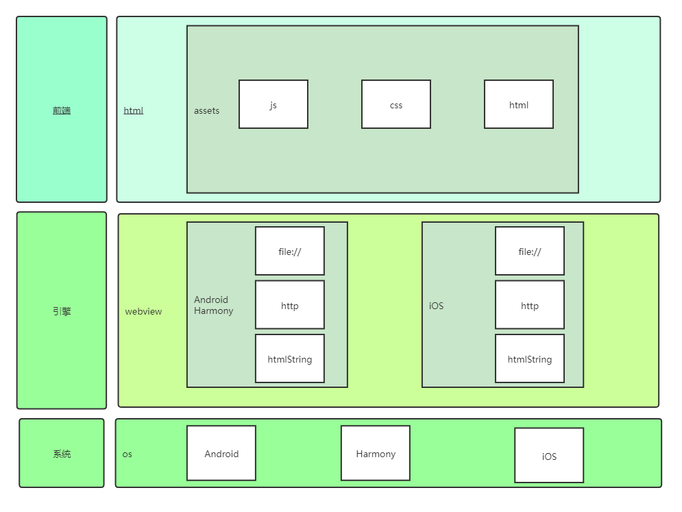
</div>

<div style="text-align:center">
   图1.1 混合开发中webview加载图
</div>

#### 加载过程

以安卓为例，加载一个webview需要WebSettings、WebViewClient、WebChromeClient共同完成，与js的交互则是由JavascriptInterface负责。

- **WebSettings** 

  主要作用是为H5设置一些配置功能，如常用设置是否支持JS`javaScriptEnabled`、设置缓存`cacheMode、是否应使用其屏幕上的缩放控件和手势支持缩放、启用或禁用WebView中的文件访问等功能

- **WebViewClient** 

  处理**各种通知和请求事件**。html页面的加载过程由这个类掌控，比较常用的方法有`shouldOverrideUrlLoading、onPageStarted、onPageFinished`。其他还有拦截页面内的网络请求，捕捉键盘事件等等。主要是了解以下：

  shouldOverrideUrlLoading： 在网页上的所有加载都经过这个方法，可以在这里对html页面进行url拦截。

  onPageStarted： 开始载入页面调用的，我们可以设定一个loading的页面，告诉用户程序在等待网络响应。

  onPageFinished： 在页面加载结束时调用。同样道理，我们可以关闭loading 条，切换程序动作。

- **WebChromeClient**

  内核处理类，主要用于网站的`加载进度、标题、图片文件选择、JS弹窗`。例如当video标签进入全屏模式时，在onShowCustomView中会有回调。onProgressChanged可以获取到网页加载进度，onReceivedTitle设置网页的title等属性。

  

  <div style="text-align: center">
      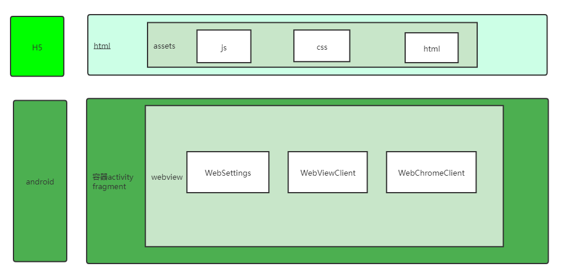
  </div>

  <div style="text-align:center">
     图1.2 android开发webview构建图
  </div>
  
  
  
  <div style="text-align: center">
      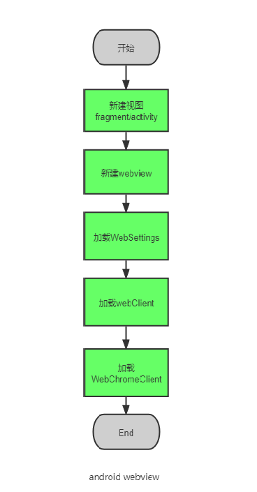
  </div>
  <div style="text-align: center">
  图1.3 android开发webview构建图
  </div>

iOS主要对比一下UIWebview以及WKWebview的流程图。加载过程中使用的函数感兴趣的可以查询资料。类比一下两者安卓中webview的加载更加碎片化，iOS过程中UIWebview与WKWebiew更加封闭，不过相对UIWebview，WKWebview更加优秀，效率更高，性能更好，WKWebview通过开启多个子线程对页面各个资源进行加载，更加细粒化。

<div style="width: 100%; display: flex; justify-content: space-around">
    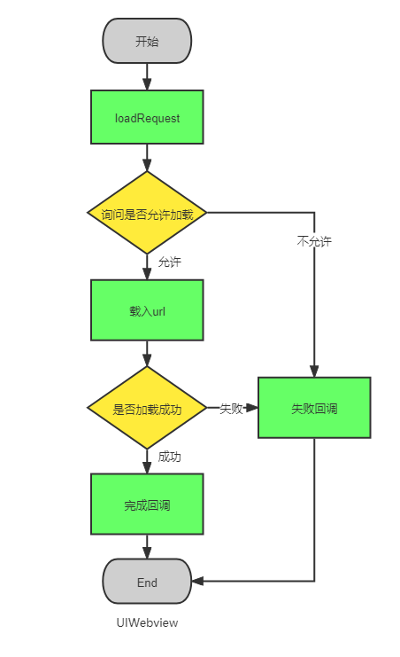
    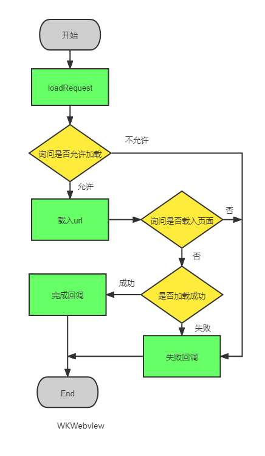
</div>


<div style="text-align: center">
图1.4 iOS开发webview加载流程图
</div>


#### 安全策略

通过以上加载说明中，无论是iOS还是android都有对url网络请求的拦截，通过如此我们可以对html页面内加载的资源进行安全白名单设置，或是对html页面内的资源请求进行过滤或是安全代理。

### 布局

​		根据webview的控件的大小，我们html的页面在app的界面上的布局可以分为两种情况，在页面上全屏嵌入，或是在页面上局部嵌入。关于两种嵌入方式在布局上的一些特点，稍后会详细说明。

#### 状态栏

全屏嵌入式，页面上有一个状态栏的显示，会出现两种现场，如下图:

<div style="width: 100%; display: flex; justify-content: space-around">
    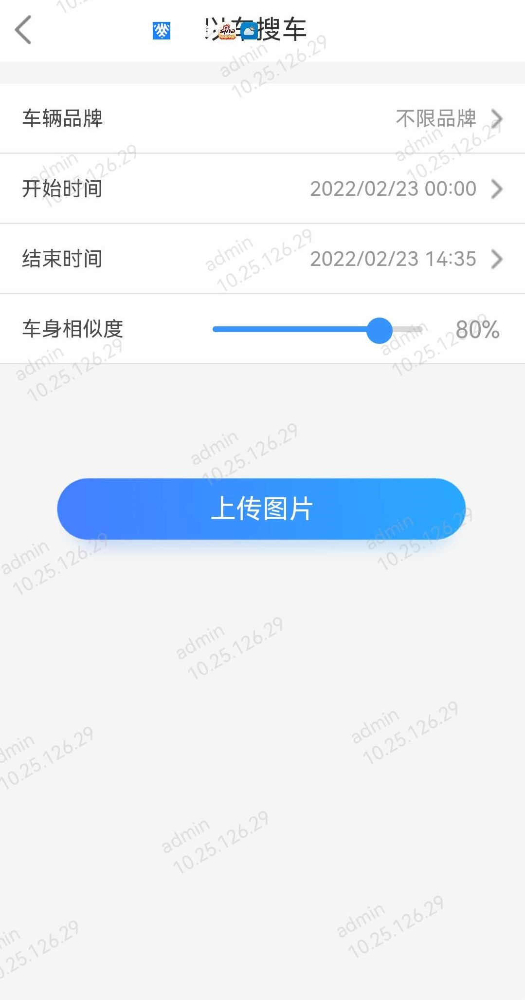
    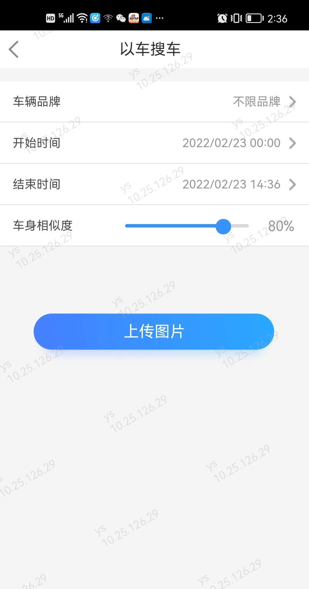
</div>

<div style="text-align: center">
图2.1 状态栏示例图一
</div>


​		左图上页面顶部直接沉入到状态栏的底下了，页面顶部的导航栏的按钮，被手机设备的状态栏给盖住了。右图上的页面顶部是从状态栏的下面，页面的顶部没有被状态栏盖住了。产生这两个现象的原因是native端webview有个状态栏模式的设置， 左图上设置的是**沉浸式**，右侧设置的**标准式**。在某些交互设计上，为了满足下图的设计，通常会默认设置webview的状态栏为沉浸式。

<div style="text-align: center">
    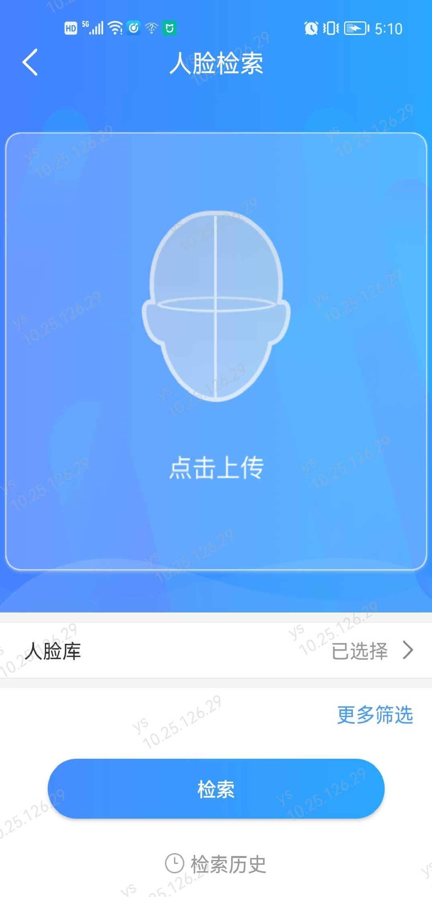
</div>
<div style="text-align: center">
 图2.2 状态栏示例图二
</div>
​		如上图所示的设计，状态栏的颜色与顶部的页面同一个颜色，这个在标准式的webview中的状态栏式无法满足的，在android系统中，状态栏只有深色和浅色两种模式，所以通常默认设置为沉浸式。

**沉浸式**在前端页面的布局中，先通过插件获取设备状态栏高度，再以css在顶部预留一个高度样式。如下代码所示：

```javascript
hatom.deviceInfo.getScreenInfo((res)=>{
    console.log(res.message);
    const screenInfo = JSON.parse(res.message)
    const h = screenInfo.statusBarHeight / screenInfo.screenDensity;
    this.appStyle = `height: calc(100% - ${h}px); top: ${h}px;`
})
```

参数说明：

| 参数     | 类型 | 必填 | 描述     |
| -------- | ---- | ---- | -------- |
| callback | 函数 | 是   | 回调函数 |

返回说明：

| 参数    | 类型   | 描述               |
| ------- | ------ | ------------------ |
| code    | String | 返回码  0表示成功  |
| message | String | 返回值 json 字符串 |

json字符串通过JSON.parse(message)转为对象, 参数如下所示：

| 参数                 | 类型   | 描述                                                      |
| -------------------- | ------ | --------------------------------------------------------- |
| screenDensityDpi     | String | 设备屏幕dpi，像素密度                                     |
| screenWidth          | String | 设备屏幕宽度dpi，像素密度                                 |
| statusBarHeight      | String | 设备状态栏高度 dpi，像素密度                              |
| screenScreenRotation | String | 设备屏幕是否旋转                                          |
| screenDensity        | String | 设备屏幕密度 dpi/px=density                               |
| screenHeight         | String | 设备屏幕高度                                              |
| appScreenWidth       | String | 应用屏幕宽度                                              |
| appScreenHeight      | String | 应用屏幕高度 appScreenHeight=screenHeight-statusBarHeight |
| clientMAC            | String | 设备mac地址                                               |
| clientIP             | String | 设备IP                                                    |

了解更多请查看：[文档](https://hatom2.hikyun.com/doc/h5-developer/api/device.html)

**标准式** 在前端页面的布局中，则不需要上面处理,在hatom2-cli的初始化[模板工程](https://hatom2.hikyun.com/doc/inner/h5-developer/H5-cli.html#%E6%A8%A1%E6%9D%BF)中,src/App.vue的文件中,删除以上的代码,在平台中配置:

<div style="text-align: center">
    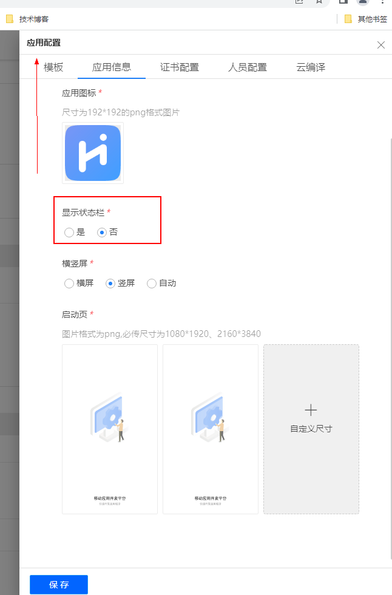
</div>
<div style="text-align: center">
 图2.2-1 状态栏示例图三
</div>  


#### 局部滚动

页面局部嵌入时，当body的高度设置为 100% 时。局部嵌入可能会导致webview渲染的高度出现问题，如下图：

<div style="width: 100%; display: flex; justify-content: space-around">
    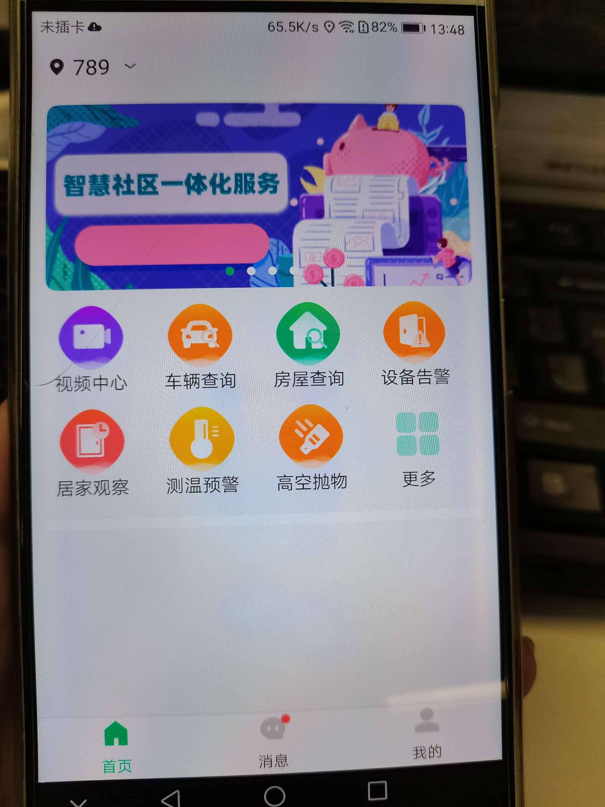
    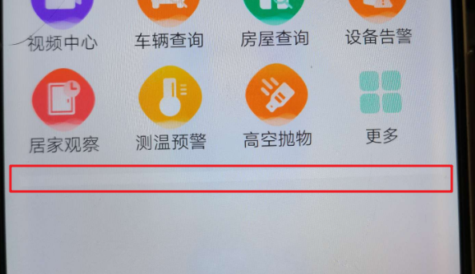
</div>

<div style="text-align: center">
图2.3 webview局部加载图
</div>

将全局的样式中 

```css
body {
    <!-- height: 100%; --> 注释掉 即可解决高度问题
}
```


#### 浮动fixed

当使用fixed布局之后，键盘弹起的时候，在浏览器和webview中会分别出现如下的情形

<div style="text-align: center;border:1px solid #efefef">
    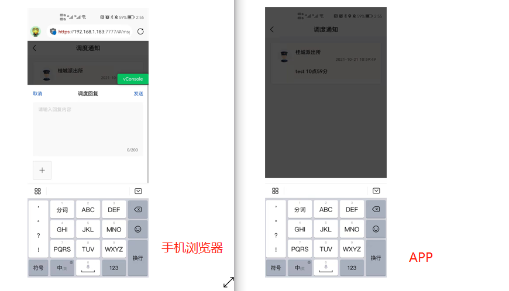
</div>

<div style="text-align: center">
图2.4  webview键盘弹出示例图
</div>

左侧在手机浏览器中，键盘会弹出，会顶起底部的输入框。在webview中，键盘的弹起不会顶起底部的输入框，出现盖住底部的输入框的BUG。这个BUG形成的原因是安卓开发中非常经典的坑，从09年安卓1.0时代一直持续到了安卓7.0。造成原因很复杂，与安卓全屏模式下的webview以及viewport高度相关

从安卓的角度来解决这个问题需要知道以下：

1. 普通Activity（不带WebView），直接使用`adjustpan`或者`adjustResize`
2. 如果带WebView：

- a) 如果非`全屏模式`(标准模式)，可以使用`adjustResize`

- b) 如果是`全屏模式`（沉浸式），则使用`AndroidBug5497Workaround`进行处理。

在前端的解决方法是：

1. 使用position：**`absolute`**替代**`fixed`** 

   通过绝对定位(position: absolute)替代固定定位( position：fixed)是曲线救国。 如果top、left 设置百分比，则同时注意设置绝对定位元素的 offsetParent 的height 和 width 值。

2. 使用resize()，通过监听**`resize`**变化

   通过resize() 方法触发 resize 事件，通过判断window高度，捕捉屏幕弹起，修改fixed为static。

#### iOS 安全区（safeArea）

iOS11之后，有了一个安全区域（safeArea）的概念。若是自定义一个底部的tarBar的导航栏，需要适配刘海屏和底部的指示条。可以使用苹果官方推出适配方案css函数env()、constant()来适配

```html
<!-- 在 head 标签中添加 meta 标签，并设置 viewport-fit=cover 值 -->
<meta
  name="viewport"
  content="width=device-width, initial-scale=1.0, 
  maximum-scale=1.0, minimum-scale=1.0,
  viewport-fit=cover"
/>
```

```css
padding-bottom: constant(safe-area-inset-bottom); /*兼容 IOS<11.2*/
padding-bottom: env(safe-area-inset-bottom); /*兼容 IOS>11.2*/
```

> env()和constant()函数有个必要的**使用前提**，当网页设置`viewport-fit=cover`的时候才生效, env()和constant()需要同时存在，而且顺序不能换.


### 交互

混合开发中，前端html页面与原生app的交互中，一般有两种方案，cordva框架的代理以及jsBridge.js。

cordva插件混合开发现在已经用的很少了，相比jsBridge.js的使用上，几乎都是之前的老项目。在native端基于cordva封装java业务插件，通过xml注册插件的资源路径以及插件的名称，在前端项目引入cordva.js库，直接通过暴露的cordva库中的插件名称，直接进行插件调用。这里只做简要介绍，感兴趣的可以查阅cordva混合开发以及cordva插件开发。

公司项目中大多数使用jsBridge.js进行交互，相比cordva.js来说，jsBridge.js使用更加轻便快捷，只需要在页面初始化中注入jsBridge.js即可。其中最大的区别在于网络请求方便，cordva中所有的http请求都是通过cordva插件代理发出，在开发调试中接口调试不是很友好。在jsBridge中，http请求与native端进行了解耦操作，能直接通过axios.js、ajax.js等前端库进行调试，在http的能通过前端js进行自主拦截或是参数调试，进一步提高了开发效率。以下介绍三种交互的方式：

#### native端调用web

native端调用js比较简单，webview作为js的寄生环境，无论是android还是iOS,都肯定有直接执行js的api，以android为例，只要遵循：”[javascript](https://cloud.tencent.com/product/sms?from=10680): 方法名(‘参数,需要转为字符串’)”的规则即可，主要说明以下注意点：

> 说明：
>
> - 4.4之前Native通过loadUrl来调用JS方法,只能让某个JS方法执行,但是无法获取该方法的返回值
> - 4.4之后,通过evaluateJavascript异步调用JS方法,并且能在onReceiveValue中拿到返回值
> - 不适合传输大量数据(大量数据建议用接口方式获取)
> - webView.loadUrl(“javascript: 方法名(‘参数,需要转为字符串’)”);函数需在UI线程运行，因为webView为UI控件

java端直接拿到前端web的方法名，直接执行方法，但在cli中，会有webpack的压缩，拿不到js的方法名。例如，我们将H5端js的方法全部写入web.js中，则需要将web.jsjs放入放入到publicPath下：

<div style="text-align: center;">
    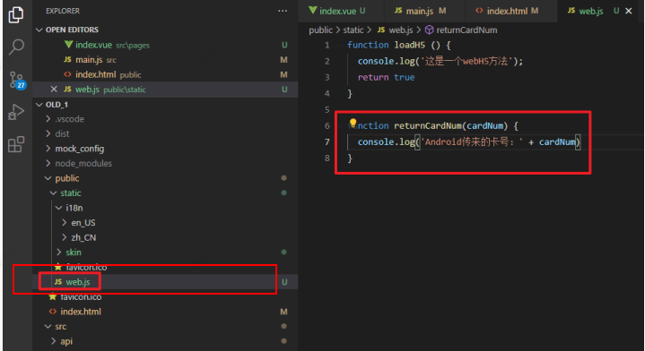
</div>

<div style="text-align: center">
图3.1 web.js交互示例一
</div>

若是需要native端主动向H5端js调用且传参，路径不必放入publicPath，我们将上文中web.js改写如下：

<div style="text-align: center;">
    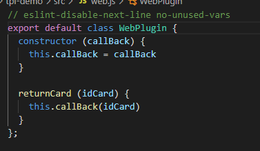
</div>

<div style="text-align: center">
图3.2  web.js交互示例二
</div>

在vue中，将web.js的对象挂载在window上

<div style="text-align: center;">
    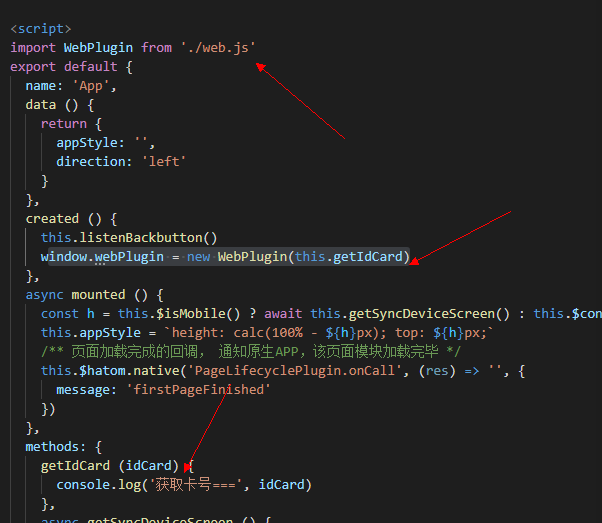
</div>

<div style="text-align: center;">
    *图3.3 web.js交互示例三*
</div>

native端java的调用方式，直接执行window.webPlugin.returnCard(“传入的值”)

<div style="text-align: center;">
    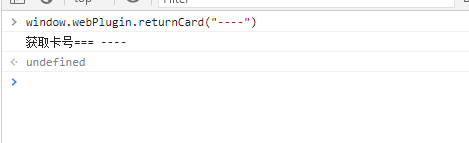
</div>

<div style="text-align: center;">
    图3.3 web.js交互示例四*
</div>																							

#### web调用native端

Js调用native端，主要以安卓为例，需要对WebView设置@JavascriptInterface注解，这里是为了解决安全漏洞。上文提到的直接使用addjavascriptInterface，会直造成诱导链接的恶意注入。要想js能够调用native端，需要对WebView的WebSettings设置以下属性：

```java
WebSettings webSettings = mWebView.getSettings();  
 //Android容器允许JS脚本
webSettings.setJavaScriptEnabled(true);
//Android容器设置桥连对象
mWebView.addJavascriptInterface(getJSBridge(), "JSBridge");
```

这里说明的是，首先需要在webview对象上注册一个JSBridge的对象，作为桥连对象，然后在这个对像里面：

```java
private Object getJSBridge(){  
    Object insertObj = new Object(){  
        @JavascriptInterface
        public String foo(){  
            return "foo";  
        }  

        @JavascriptInterface
        public String foo2(final String param){  
            return "foo2:" + param;  
        }  

    };  
    return insertObj;  
} 
```

H5端直接在window上获取jsBridge对象

```javascript
//调用方法一
window.JSBridge.foo(); //返回:'foo'
//调用方法二
window.JSBridge.foo2('test');//返回:'foo2:test'
```


#### 带callback的双向调用

同样是通过构建jsBridge.js构建一个H5端js和native端之前的桥梁。原理是native端webView拦截H5资源包加载方式，由前端页面通过某种方式触发scheme(如用iframe.src)，然后native端通过拦截api方法捕获对应的url触发事件,然后拿到当前的触发url,根据定义好的协议,分析当前触发了那种方法。具体流程如下：

<div style="text-align: center;">
    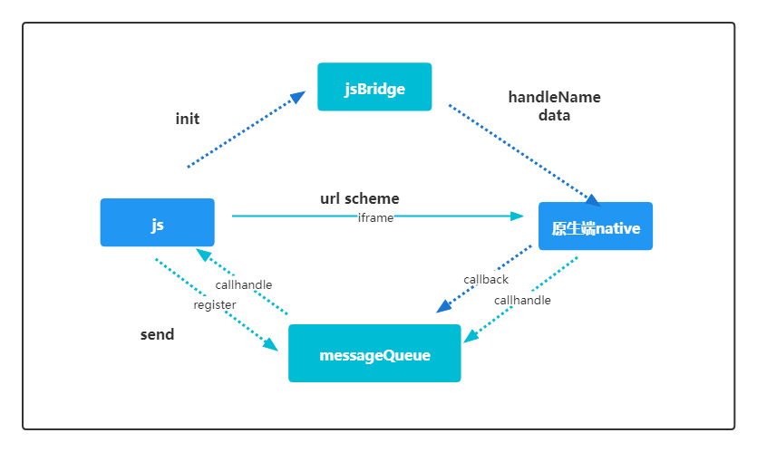
</div>
<div style="text-align: center">
jsbridge.js交互示例一
</div>


初始化流程是：

- H5端在页面中注入一个隐藏的iframe标签，并自定义scheme url 协议。
- 同时构建jsBridge对象，添加注册方法，将H5端的方法注册到messgeQueue队列中。

当js调用native时

- 通过jsBridge对象使scheme url变更，触发webview重载机制。
- 当native端重载机制中，去获取到jsBridge对象分发的handleName以及data并执行，执行结果。
- 执行完直接之后，从注册的messgeQueue队列中找到callbackId对应的callhandle, 执行回调。

当native调用js时

- 当native则需要在messageQueue中找到注册的callhandle执行的，直接执行。

整体流程如下图所示：

<div style="text-align: center;">
    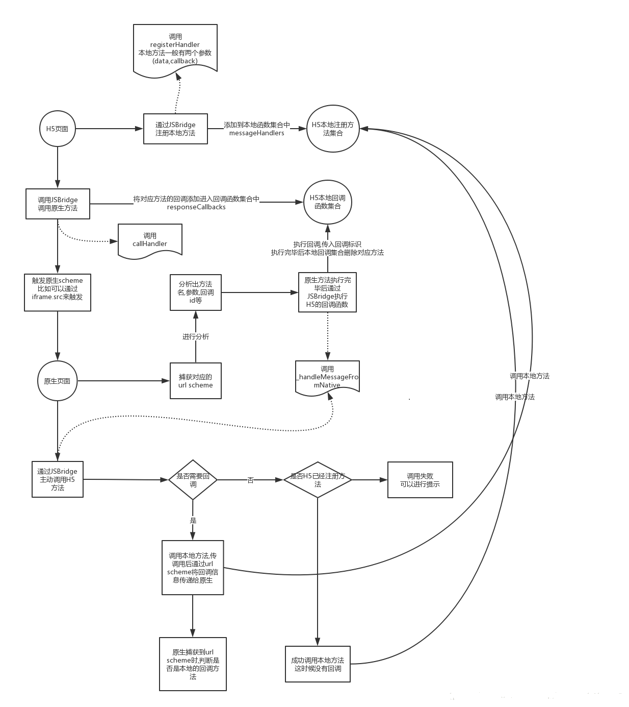
</div>
<div style="text-align: center">
	图3.5 jsbridge.js交互示例二
</div>


### 总结

以上就是简单的webview控件混合开发移动app的简要总结。当前市场上其他移动app的开发思路出了这种之后，还有其他两种，分别是基于浏览chrome内核、webview控件等、或其他js引擎封装出自定义的引擎。另一种是通过自定义编译工具，将div/css等标签封装成私有的class作为自定义原生控件。
