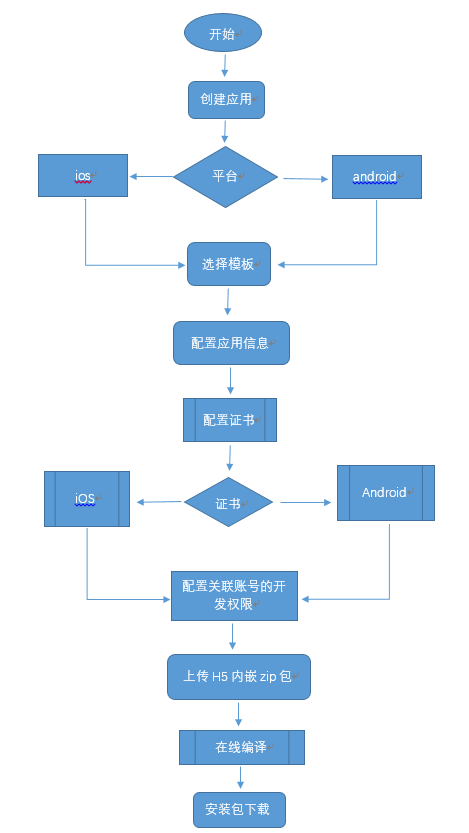
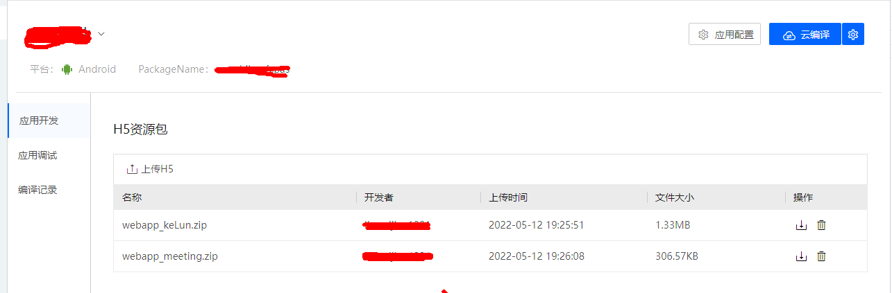
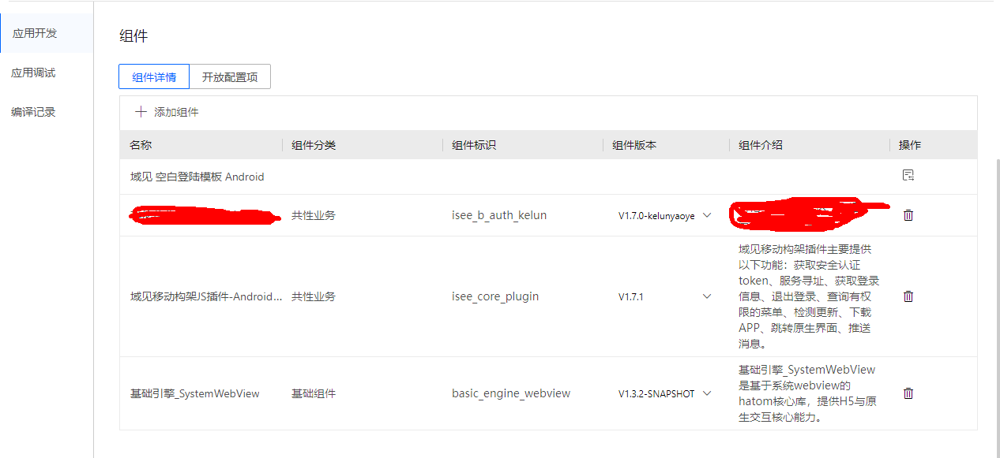
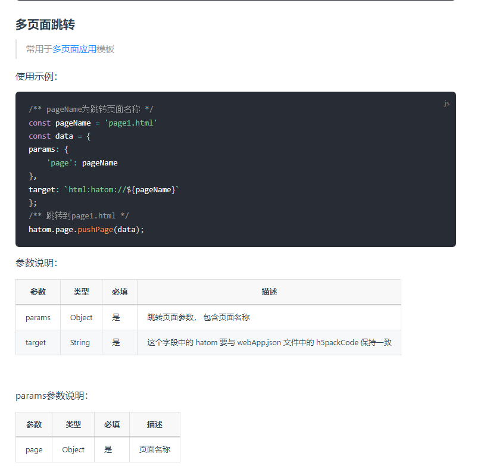
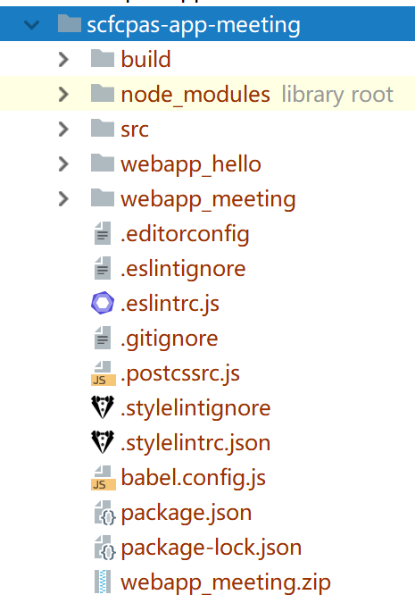
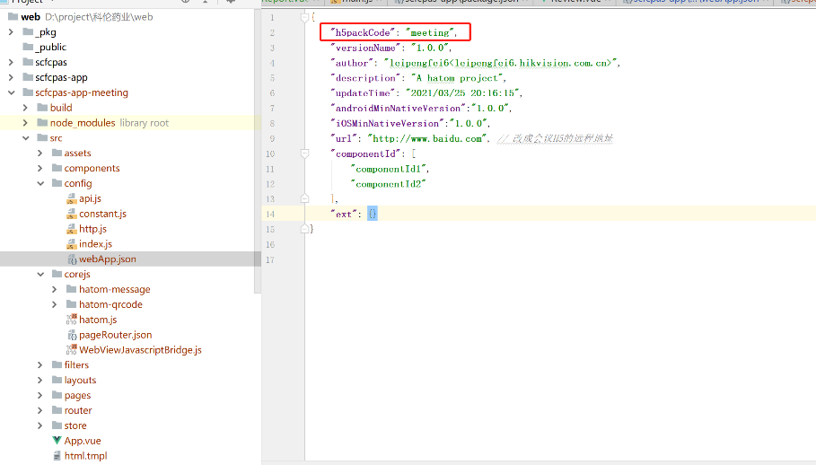
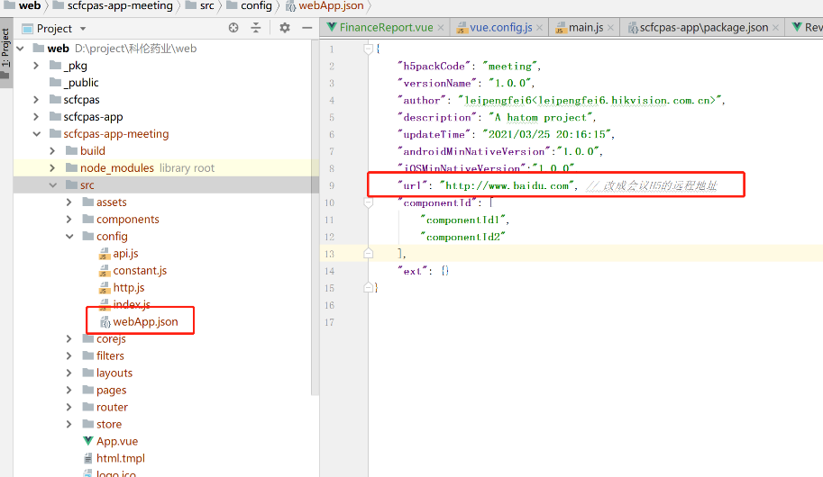
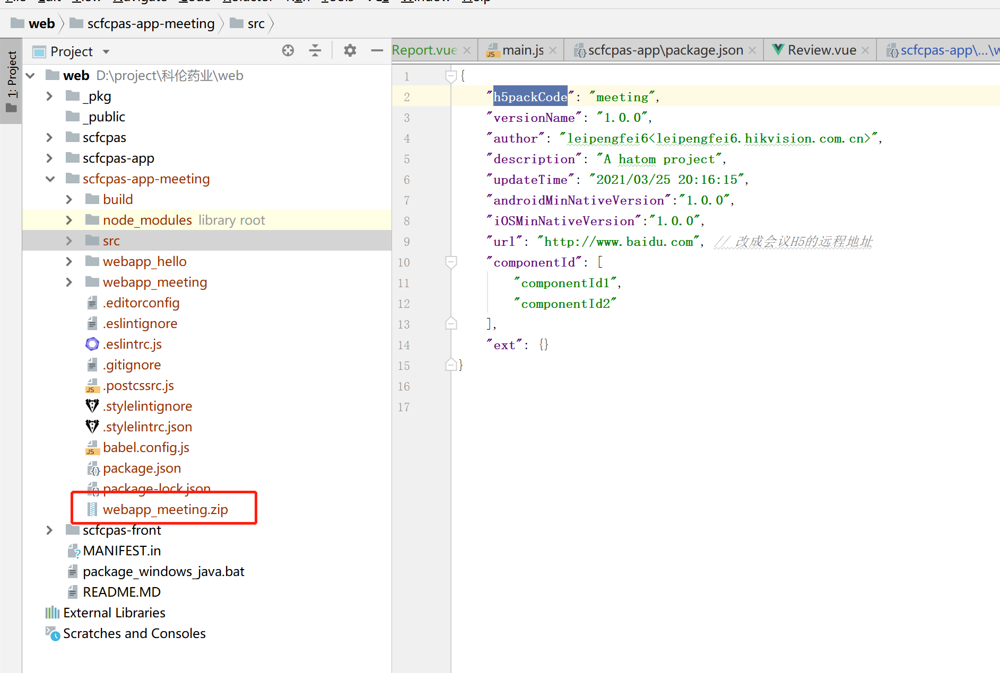
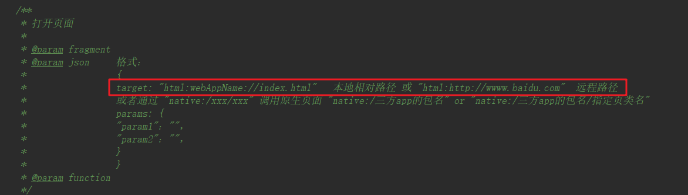

## 移动应用开发集成多包的案例

移动应用开发中，分模块开发已经是开发流程中，众所周知的方式。我们经常会遇到在APP的混合开发中的，集成了多个H5的模块。

### **前提**

APP中集成的H5模块，需要符合hatom2-cli脚手架[成果物规范](https://hatom2.hikyun.com/doc/inner/problem/problem2.html#_5-%E6%89%93%E5%8C%85%E4%B9%8B%E5%90%8E%E6%88%90%E6%9E%9C%E7%89%A9)，同时基于移动应用开发平台（以下简称，Hatom平台），打包编译服务，才能集成。采用该方案需要提前了解[Hatom平台](https://hatom2.hikyun.com/doc/inner/quick-start/quick-start.html#_1%E3%80%81%E5%88%9B%E5%BB%BA%E5%BA%94%E7%94%A8)，以及[hatom2-cli脚手架](https://hatom2.hikyun.com/doc/inner/h5-developer/H5-developer.html)开发移动应用APP。

### **新建应用**

在移动应用开发平台中新建应用（Android 或 iOS），然后选择模板、配置应用信息（包括应用名称、应用图标、是否显示状态栏、是否横竖屏、启动页）、配置证书、上传H5资源包（如有需要）、选择组件、配置开放配置项，最后执行云编译，完成应用构建。

<div style="text-align: center">
    
</div>
<div style="text-align: center">
 图1.1 新建应用流程
</div>  

### 上传H5.zip

在应用详情里面，应用开发菜单里面H5资源包模块，如下图：

<div style="text-align: center;border:1px solid #efefef">
    
</div>
<div style="text-align: center">
 图1.2 应用H5.zip资源包
</div>  


### H5资源包交互组件

在资源包之间的跳转的交互，当需要从一个H5资源包跳转到另外一个H5资源包中，则需要集成基础引擎插件：

<div style="text-align: center;border:1px solid #efefef">
    
</div>
<div style="text-align: center">
 图1.3 基础引擎应用组件
</div>  

### H5资源包交互API

在资源包之间的跳转的交互的API，则需要查询[帮助文档](https://hatom2.hikyun.com/doc/plugin/router.html)路由API

<div style="text-align: center;border:1px solid #efefef">
    
</div>
<div style="text-align: center">
 图1.4 路由API文档
</div>  

其中params是透传参数，用于[登录组件](https://hatom2.hikyun.com/doc/plugin/root-info.html)的拓展参数routeData，暂无需理解，需要分析的是target参数

`html + h5packCode + html文件路径`

其中html代表协议，跳转的目标是H5资源包，h5packCode 资源包的唯一标识，html文件路径是成果物中html文件路径名，解析中注意的是pageRouter.json文件中的配置，同时html文件名需要匹配上。

```json
{
  "routes": [
    {
      "type": "standard",
      "name": "首页",
      "path": "index.html",
      "tabBar": [],
      "data": {}
    },
    {
      "type": "standard",
      "name": "首页",
      "path": "html路径 + 静态参数", // 此处的参数与target参数中 html文件路径全匹配上
      "tabBar": [],
      "data": {}
    }
  ] 
}
```


### 拓展：嵌入远程包

#### **方法一**

我们在集成的模块提供方，除了是静态资源包之外，还有远程链接，对于这种情况，我们H5组件中需要加载远程的内容嵌入其中。这需要用到一个配置文件webApp.json中的url字段。步骤如下：

先安装hatom2-cli脚手架，通过脚手架建立一个空的工程，找到webApp.json中的h5packCode字段，修改包的标识

<div style="text-align: center;border:1px solid #efefef">
    
</div>

<div style="text-align: center;border:1px solid #efefef">
    
</div>


<div style="text-align: center">
 图1.5 新建空包
</div>

接着找到webApp.json中的url字段，修改url内容为加载的远程地址：

<div style="text-align: center;border:1px solid #efefef">
    
</div>

<div style="text-align: center">
 图1.6 加载远程链接
</div>


再打包生成zip包成果物

<div style="text-align: center;border:1px solid #efefef">
    
</div>

<div style="text-align: center">
 图1.7 成果物zip包
</div>
最后上传资源包，见步骤上传H5.zip资源包。

> 该方法中可以配置白名单，在webApp.json中添加字段whiteList, 见[文档](https://hatom2.hikyun.com/doc/inner/h5-developer/H5-cli.html#%E4%B8%9A%E5%8A%A1%E9%85%8D%E7%BD%AE)

#### **方法二**

相比于方法一，该方法不是很推荐，对于嵌入的内容有很多不可控因素，在保证资源可靠的情况下，可以使用

同样是基于方法一中的API

<div style="text-align: center;border:1px solid #efefef">
    
</div>
<div style="text-align: center">
 图1.4 路由API文档
</div>  


target参数格式需要变化一下 `html + http/https:// + 远程路径`  如下图：

<div style="text-align: center;border:1px solid #efefef">
    
</div>
<div style="text-align: center">
 图1.8 参数变化
</div>  


总结：该文档是基于H5包之间的跳转流程， 其他跳转到APP原生界面的API见[帮助文档](https://hatom2.hikyun.com/doc/plugin/router.html#%E8%B7%B3%E8%BD%AC%E5%8E%9F%E7%94%9F%E9%A1%B5%E9%9D%A2)，跳转第三方应用的[文档API](https://hatom2.hikyun.com/doc/plugin/router.html#%E8%B7%B3%E8%BD%AC%E7%AC%AC%E4%B8%89%E6%96%B9%E5%BA%94%E7%94%A8)

